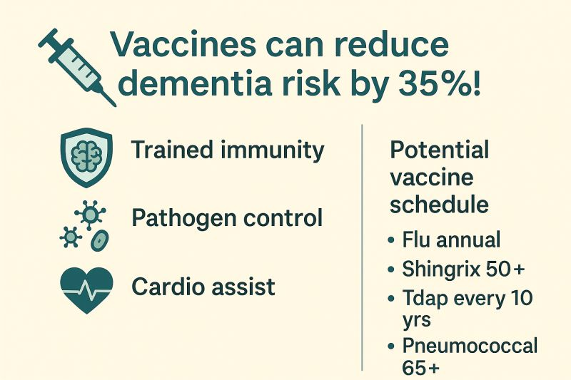

In another chapter of the "weird but makes sense" files: vaccines can cut dementia risk by about 35%.

Eric Topol's write-up maps the links between routine vaccines and dementia risk [1].

{fig-alt="Illustration linking vaccines and dementia risk reduction"}

### Why might this happen?

- **Trained immunity:** vaccines reset innate immune cells, damping chronic inflammation that ages the brain and vasculature.
- **Pathogen control:** fewer viral reactivations (for example VZV) that can trigger neurodegeneration.
- **Cardio assist:** the same flu shot that lowers dementia also cuts heart-attack and stroke risk by about 30%, tightening the vascular-brain link.

### Bottom line

Your standard adult schedule - annual flu, Shingrix at 50+, Tdap every 10 years, pneumococcal at 65+ [2] - is looking like a low-cost, multi-organ longevity play: protecting you today and for decades to come.

More of my reflections on preventing dementia:

- Up to 45% of dementia risk is modifiable with lifestyle actions.
- Lifestyle changes can even reverse Alzheimer's molecular signatures back toward normal in some documented cases.

Know your risk, take small steps now, and your future self will thank you.

## References

1. [Eric Topol. The Shingles Vaccine and Reduction of Dementia. Ground Truths, 14 March 2025.](https://erictopol.substack.com/p/the-shingles-vaccine-and-reduction)
2. [CDC. Adult Immunization Schedule by Age - United States, 2025.](https://www.cdc.gov/vaccines/hcp/imz-schedules/adult-age.html)
