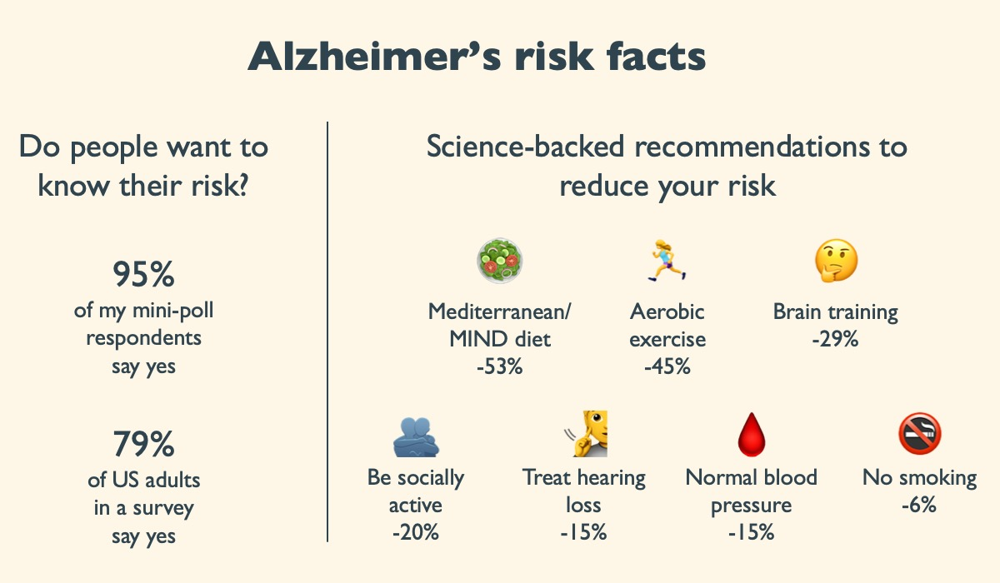

Next time someone insists that people do not want to know their Alzheimer's risk, ask for their evidence, and then show them this.

That is exactly what I will do, while swallowing my frustration, as it will be the 1,241,743,278th time I have heard that comment while pitching TrueYouOmics.

{fig-alt="Graphic on Alzheimer's risk awareness and prevention levers"}

### The know-and-act path is becoming real

Recent science makes proactive brain health more practical than hope-and-wait:

- Blood-based biomarkers such as p-tau217 can spot Alzheimer's biology years earlier, with reported accuracy around 90% in recent coverage of emerging tests [11, 12]. They may eventually sit alongside glucose and LDL in routine panels.
- Roughly 45% of dementia risk can be modified by lifestyle and clinical factors such as exercise, blood pressure, hearing, sleep, education, and more [13].
- Case reports and structured lifestyle programmes have shown large downward shifts in Alzheimer's-related blood markers for some people after targeted changes [11, 14]. These are not population-level proof, but they show why early insight matters.

### Do people actually want to know?

In a small LinkedIn poll I ran, 20 of 21 respondents (95%) said yes to learning their personal Alzheimer's risk [1].

That aligns with a recent US survey: 79% of 1,700 U.S. adults in the 2025 Alzheimer's Facts & Figures survey want to know before symptoms appear [2].

That is one of the reasons why the Alzheimer's Association is already urging primary-care teams to prepare for blood-based biomarker tests that can spot the disease years earlier, giving people time to act [3].

### Seven science-backed levers to cut risk

Percentages below are relative-risk reductions reported by each study; individual benefit will vary.

1. Adopt a Mediterranean / MIND eating pattern: up to 53% risk reduction (Rush Memory & Aging Project) [4]
2. Keep blood pressure in a healthy range, especially mid-life: 15% fewer dementia cases with intensive control (34,000-person Nature Medicine trial) [5]
3. Treat hearing loss with hearing aids: 48% slower cognitive decline in high-risk older adults (ACHIEVE RCT) [6]
4. Quit smoking entirely: 6% lower Alzheimer's (790,000-person Korean cohort) [7]
5. Do speed-of-processing brain training: 29% lower dementia incidence ten years later (ACTIVE trial) [8]
6. Stay socially engaged: about 15-20% lower risk among socially active UK Biobank participants [9]
7. Move more (at least 150 min/week of aerobic exercise): about 45% lower Alzheimer's risk across a 16-study meta-analysis [10]

### Take-home

This clear dominance of "yes" signals a shift toward proactive brain health.

Combining earlier diagnostics with lifestyle tweaks lets each of us take charge long before medication is the only option.

If you want the catalogue of available tests, see [How to know your Alzheimer's risk](../2025-07-11-alzheimer-tests/).

## References

1. LinkedIn poll summary (20 of 21 respondents preferred to know and act)
2. [Alzheimer's Association, Facts & Figures 2025](https://www.alz.org/news/2025/facts-figures-report-alzheimers-treatment)
3. [ABC News coverage of earlier diagnostic testing recommendations](https://abcnews.go.com/Health/alzheimers-society-calls-doctors-newer-early-diagnostic-testing/story?id=121163860)
4. [Rush Memory & Aging Project / Mediterranean-MIND diet evidence](https://pmc.ncbi.nlm.nih.gov/articles/PMC4532650/)
5. [Intensive blood-pressure control and dementia risk](https://www.scientificamerican.com/article/treating-high-blood-pressure-reduces-dementia-risk/)
6. [ACHIEVE study key findings](https://www.achievestudy.org/key-findings)
7. [Smoking and dementia risk summary](https://www.verywellhealth.com/cigarette-use-dementia-7099235)
8. [ACTIVE trial](https://pmc.ncbi.nlm.nih.gov/articles/PMC5700828/)
9. [Social engagement and dementia risk](https://www.health.com/news/dementia-risk-exercise-chores-socializing)
10. [Exercise and Alzheimer's risk meta-analysis summary](https://longevity.stanford.edu/lifestyle/2024/05/28/how-exercise-reduces-risk-of-alzheimers-disease/)
11. [CNN on Alzheimer's blood biomarkers](https://edition.cnn.com/2025/04/07/health/alzheimer-risk-blood-biomarkers-wellness/index.html)
12. [Eric Topol on the breakthrough blood test for Alzheimer's](https://erictopol.substack.com/p/the-breakthrough-blood-test-for-alzheimers)
13. Lancet Commission style estimate often summarised as ~45% modifiable dementia risk across lifestyle and clinical factors
14. Public case discussions of biomarker improvement after structured lifestyle programmes (for example Simon Nicholls and Penny Ashford)
