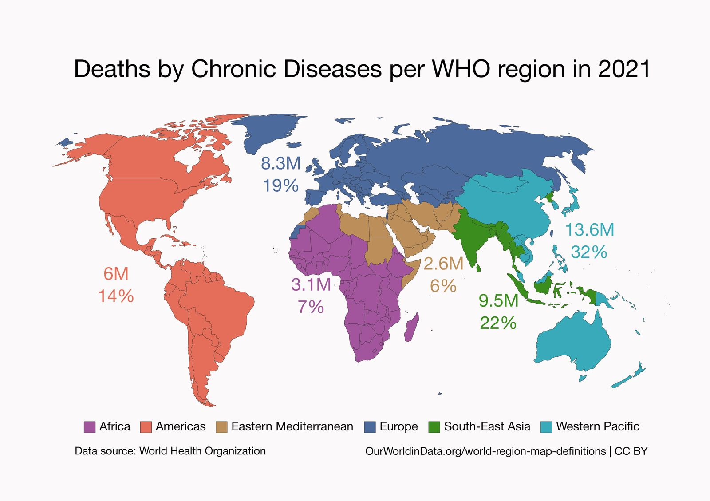

::: {.tldr}
**TLDR.** 43 million people died from chronic diseases in 2021, and about 80% of those deaths are considered preventable. Here is the country and regional breakdown from WHO data.
:::

43 million people died from chronic diseases (like hypertension, cardiovascular disease, diabetes, kidney disease, or obesity) in 2021 [1].

And 80% of those deaths are preventable by identifying and addressing modifiable risk factors such as smoking, poor diet, and physical inactivity [2].

Which are the top countries by number of deaths?

Georges Khneysser asked me about the country-by-country distribution of these deaths after my TrueYouOmics pitch at the CSEM Startup Night.

My memory betrayed me regarding the figure for the United States; therefore, I have pulled the latest 2021 data from the World Health Organization to set the record straight [1].

### Regional snapshot

{fig-alt="Map of NCD deaths by WHO region"}

- Western Pacific: 13.6M (32%)
- South-East Asia: 9.5M (22%)
- Europe: 8.3M (19%)
- Americas: 6M (14%)
- Africa: 3.1M (7%)
- Eastern Mediterranean: 2.6M (6%)

### Twenty countries with the highest numbers of chronic-disease deaths in 2021

1. China: 10.45M (24.2%)
2. India: 6.40M (14.8%)
3. United States: 2.67M (6.2%)
4. Russian Federation: 1.53M (3.5%)
5. Indonesia: 1.38M (3.2%)
6. Japan: 1.18M (2.7%)
7. Brazil: 1.10M (2.5%)
8. Germany: 880K (2.0%)
9. Pakistan: 870K (2.0%)
10. Philippines: 620K (1.4%)
11. Italy: 580K (1.3%)
12. Bangladesh: 580K (1.3%)
13. Ukraine: 560K (1.3%)
14. Mexico: 560K (1.3%)
15. Viet Nam: 550K (1.3%)
16. United Kingdom: 550K (1.3%)
17. France: 510K (1.2%)
18. Egypt: 480K (1.1%)
19. Nigeria: 470K (1.1%)
20. Türkiye: 460K (1.1%)

These numbers represent millions of families facing premature loss, billions in treatment costs, and an enormous loss of economic productivity.

Because most of these deaths are preventable, early detection and lifestyle-focused intervention must be a global priority.

## References

1. [WHO Global Health Estimates, leading causes of death](https://www.who.int/data/gho/data/themes/mortality-and-global-health-estimates/ghe-leading-causes-of-death)
2. [NCD Alliance on financing and preventable NCD burden](https://ncdalliance.org/why-ncds/financing-ncds)
