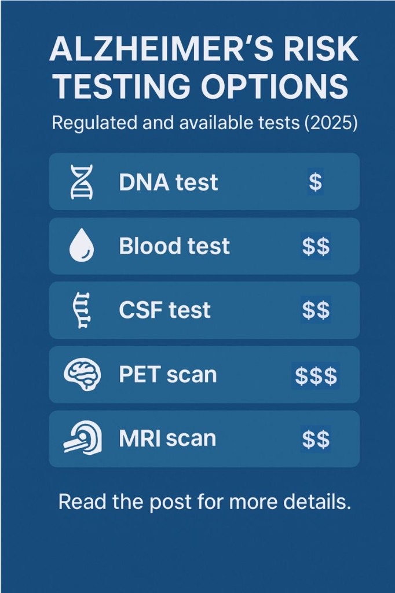

::: {.tldr}
**TLDR.** A practical catalogue of DNA, blood, CSF, PET and MRI options for Alzheimer's risk and pathology. Almost everything is available in the US; very few options are easy to get in the UK and EU.
:::

{fig-alt="Infographic titled Alzheimer's Risk Testing Options (2025) listing DNA test, blood test, CSF test, PET scan, and MRI scan with relative cost markers"}

How to know your Alzheimer's risk? Check the options below.

Except for 23andMe, every test requires a doctor's prescription, but they are generally accessible through private clinics.

This list includes only assays with some form of regulatory clearance; it is not comprehensive (other companies may offer comparable tests).

Some of the options estimate long-term risk (about 10 years), and others measure current biological changes that increase your shorter-term risk (about 3-5 years).

Blood-based markers such as p-tau217 are moving fast. Recent reporting suggests they can spot Alzheimer's biology years earlier, with accuracy figures around 90% in some settings [31, 32]. That is why catalogues like this matter: knowing which tool answers which question is half the battle.

### DNA tests

**23andMe APOE ε4 Genotyping**

- Company: 23andMe
- Accuracy: 99% in detecting the mutation [1]
- Status: FDA-authorized [2]
- Country: US, UK, Denmark, Finland, Ireland, Netherlands and Sweden [3]
- Price: $199 [4]

**Invitae Hereditary Alzheimer's Disease Panel (APP, PSEN1, PSEN2)**

- Company: Invitae (Labcorp)
- Accuracy: 99% in detecting the mutations [5]
- Status: CLIA-certified, not FDA-cleared [5]
- Country: US, and case-by-case in EU [5]
- Price: from $299 [6]

### Blood tests

**Lumipulse G p-tau217 / β-amyloid 1-42**

- Company: Fujirebio
- Accuracy: 94% when "indeterminate" results are excluded; 75% when counted as incorrect [7]
- Status: FDA-cleared [8]
- Country: US [8]
- Price: $500 - $1,000 [9]

**PrecivityAD2 p-tau217 + Aβ42/40**

- Company: C2N Diagnostics
- Accuracy: 88% [10]
- Status: CLIA LDT, not FDA-cleared [11] and MHRA certified [12]. Previous version (PrecivityAD) CE marked [13]
- Country: US [11] and UK [12]. Previous version (PrecivityAD) in EU [13]
- Price: $1,450 [14]

**LucentAD p-tau217**

- Company: Quanterix
- Accuracy: 93% [15]
- Status: CLIA LDT, not FDA-cleared [16][17]
- Country: US [16]
- Price: $300 [14]

### CSF, PET and MRI

**Lumipulse G β-amyloid Ratio (CSF)**

- Company: Fujirebio
- Accuracy: 90% [18]
- Status: FDA approved [18] and CE marking [19]
- Country: US [20] and EU [19]
- Price: $800 - $1,500 [21]

**PET: β-amyloid neuritic plaque density**

- Company: Eli Lilly (Amyvid / Avid), Life Molecular Imaging (Neuraceq), GE HealthCare (Vizamyl)
- Accuracy: 95% [22]
- Status: FDA and EMA approved [22]
- Country: US [23] and EU [22]
- Price: about $5,000 [24]

**PET: aggregated tau neurofibrillary tangles**

- Company: Eli Lilly (Tauvid)
- Accuracy: 78%-92% [25]
- Status: FDA and EMA approved [26]
- Country: US and EU [26]
- Price: about $5,000 [24]

**MRI: NeuroQuant volumetric brain and ARIA**

- Company: Cortechs.ai
- Accuracy: 84% [27]
- Status: FDA cleared [28] and CE marked [29]
- Availability: US [28], UK and EU [29]
- Price: $500 - $600 [30]

If you want the prevention levers that matter once you know your risk, see [People do want to know their Alzheimer's risk](../2025-07-08-alzheimer-risk/).

## References

1. [23andMe Genetic Health Risk Report package insert](https://medical.23andme.com/wp-content/uploads/2017/09/PN-20-0234-Rev-A-Genetic-Health-Risk-Report-Package-Insert_for-Marketing.pdf)
2. [FDA, Direct-to-consumer tests](https://www.fda.gov/medical-devices/in-vitro-diagnostics/direct-consumer-tests)
3. [23andMe shipping countries](https://customercare.23andme.com/hc/en-us/articles/360000145307-What-Countries-Do-You-Ship-To)
4. [23andMe DNA Health + Ancestry](https://www.23andme.com/dna-health-ancestry)
5. [Invitae Hereditary Alzheimer's Disease Panel](https://www.invitae.com/us/providers/test-catalog/test-03504)
6. [Invitae billing](https://www.invitae.com/us/providers/billing?tab=outside-of-the-united-states)
7. [FDA K242706 decision summary](https://www.accessdata.fda.gov/cdrh_docs/pdf24/K242706.pdf)
8. [FDA clears first blood test used in diagnosing Alzheimer's disease](https://www.fda.gov/news-events/press-announcements/fda-clears-first-blood-test-used-diagnosing-alzheimers-disease)
9. [What to know about the new blood test for Alzheimer's](https://www.alzinfo.org/articles/diagnosis/what-to-know-about-the-new-blood-test-for-alzheimers/)
10. [PrecivityAD2 accuracy evidence](https://pmc.ncbi.nlm.nih.gov/articles/PMC11095426/)
11. [C2N PrecivityAD2 clinical-care release](https://c2n.com/news-releases/cnnbspdiagnostics-releases-the-precivityad2-blood-test-for-clinical-care)
12. [C2N PrecivityAD2 MHRA certification](https://c2n.com/news-releases/c2n-diagnostics-precivityad2-blood-test-receives-mhra-medical-device-certification-in-the-united-kingdomnbsp)
13. [PrecivityAD CE marking coverage](https://alzheimersweekly.com/precivityad-blood-test-helps-diagnose/)
14. [Being Patient on Alzheimer's blood-test pricing](https://www.beingpatient.com/how-much-is-an-alzheimers-blood-test/)
15. [LucentAD accuracy poster update](https://www.lucentdiagnostics.com/wp-content/uploads/2025/04/LucentAD_CTAD_PosterUpdate_FINAL.2.pdf)
16. [Quanterix p-tau217 blood biomarker launch](https://www.quanterix.com/press-releases/quanterix-launches-high-accuracy-p-tau-217-blood-biomarker-test-to-aid-physician-diagnosis-of-alzheimers-disease/)
17. [LucentAD Complete](https://www.lucentdiagnostics.com/tests/lucentad-complete/)
18. [FDA DEN200072 review](https://www.accessdata.fda.gov/cdrh_docs/reviews/DEN200072.pdf)
19. [Fujirebio Lumipulse G beta-amyloid 1-40](https://www.fujirebio.com/en/products-solutions/lumipulse-g-beta-amyloid-1-40)
20. [FDA permits marketing of CSF Alzheimer's test](https://www.fda.gov/news-events/press-announcements/fda-permits-marketing-new-test-improve-diagnosis-alzheimers-disease)
21. [AAFP diagnostic tests for Alzheimer disease](https://www.aafp.org/pubs/afp/issues/2023/0500/diagnostic-tests-alzheimer-disease.html)
22. [EMA Amyvid assessment report](https://www.ema.europa.eu/en/documents/assessment-report/amyvid-epar-public-assessment-report_en.pdf)
23. [FDA Amyvid clinical pharmacology review](https://www.accessdata.fda.gov/drugsatfda_docs/nda/2012/202008Orig1s000ClinPharmR.pdf)
24. [Radiology Today on PET pricing context](https://www.radiologytoday.net/archive/rt_Oct23p22.shtml)
25. [Lilly Tauvid accuracy information](https://medical.lilly.com/us/products/answers/what-is-the-test-accuracy-of-tauvid-flortaucipir-f-18-191627)
26. [Flortaucipir legal status overview](https://en.wikipedia.org/wiki/Flortaucipir_(18F)#Legal_status)
27. [NeuroQuant accuracy preprint](https://www.preprints.org/manuscript/202310.0774/v1)
28. [FDA clears NeuroQuant 5 software](https://www.neurologylive.com/view/fda-clears-cortechs-ai-neuroquant-5-software-quantification-segmentation-aria-e-aria-h)
29. [NeuroQuant CE marking](https://www.cortechs.ai/neuroquant-ce-marking)
30. [MD Save NeuroQuant pricing example](https://www.mdsave.com/procedures/brain-mri-with-neuroquant-screen/d382fcc5)
31. [CNN on Alzheimer's blood biomarkers](https://edition.cnn.com/2025/04/07/health/alzheimer-risk-blood-biomarkers-wellness/index.html)
32. [Eric Topol on the breakthrough blood test for Alzheimer's](https://erictopol.substack.com/p/the-breakthrough-blood-test-for-alzheimers)
