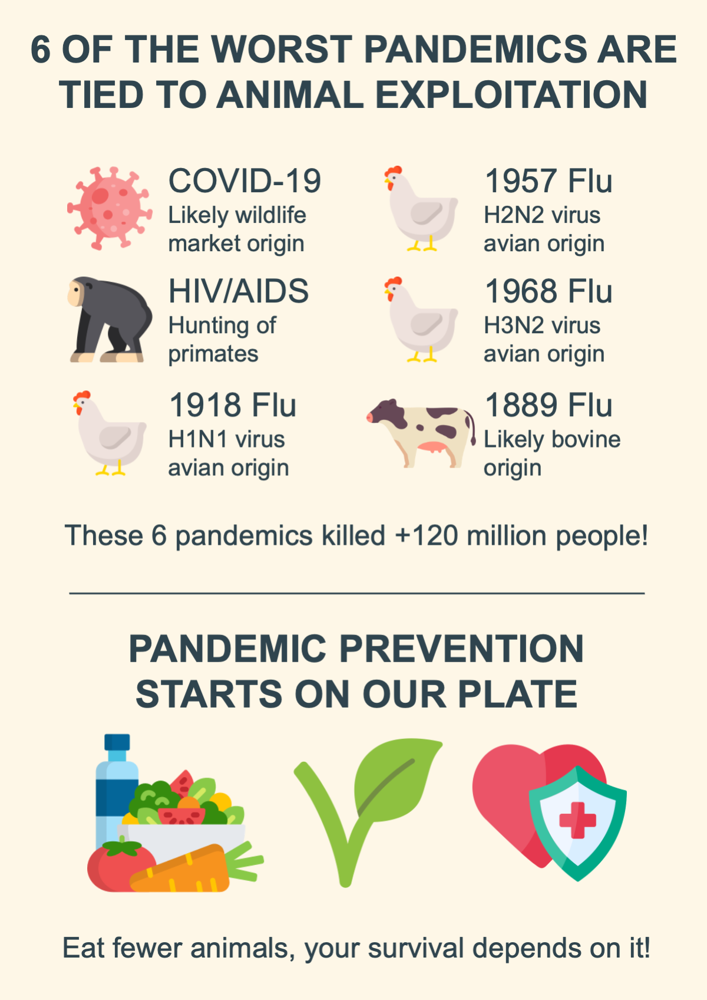

::: {.tldr}
**TLDR.** Six of the worst modern pandemics are linked to animal-human interfaces. Pandemic prevention starts by shrinking those high-risk contacts.
:::

Six of the worst ten pandemics in modern history share a common thread: animal exploitation. [1-6]

{fig-alt="Infographic linking major pandemics to animal exploitation"}

**COVID-19.** Most evidence points to a wildlife-market origin at the Huanan market, with animal and environmental samples testing positive. While debate persists, prudent risk reduction targets animal-human interfaces. [1-4]

**HIV/AIDS.** Cross-species transmission of simian viruses to humans, likely during hunting and butchering of primates, has caused a pandemic with tens of millions of deaths. [5-7]

**1918 influenza.** An H1N1 virus with genes of avian origin caused at least 50 million deaths worldwide. [8-9]

**1957 influenza.** An H2N2 avian-human reassortant caused about 1.1 million deaths globally. [10-11]

**1968 influenza.** An H3N2 avian-human reassortant caused about 1 million deaths worldwide. [12-13]

**1889 "Russian flu".** Several lines of evidence suggest a bovine-to-human coronavirus spillover around 1890, coinciding with cattle epizootics, with an estimated toll near 1 million. [14-15]

These six pandemics account for well over 120 million deaths. [7, 9, 11-12, 15, 17-18]

### Why this keeps happening

**High-risk interfaces.** Wildlife trade and markets, bushmeat, and intensive poultry and pig farming repeatedly create opportunities for spillover. [19-20]

**Biology enables it.** Pigs can act as "mixing vessels" for avian and human influenza viruses, facilitating reassortment. [16]

**Land-use change.** Agricultural expansion, especially for livestock grazing, is a major driver of deforestation and brings people, livestock, and wildlife into closer contact. [21-22]

### The best prevention

- Shift decisively toward plant-based food systems. Cutting demand for animal protein reduces the most frequent drivers of zoonotic emergence, with policy options that include fiscal measures on meat and livestock production. [19-20]
- Shut down wildlife trade and markets; reduce contact and monitor interfaces. [23]
- Stop clearing forests and degrade fewer of them; restore ecosystems to shrink spillover opportunities. [23]

The path to pandemic prevention starts on our plates, and it leads to ethical, sustainable, and resilient communities for all.

What is stopping you from eating and exploiting fewer animals? Your survival and your family's survival depend on it.

## References

1. [Science paper on COVID origins evidence](https://www.science.org/doi/10.1126/science.abp8715)
2. [Cell paper on Huanan market evidence](https://www.cell.com/cell/fulltext/S0092-8674%2824%2900901-2)
3. [Nature paper on SARS-CoV-2 origins](https://www.nature.com/articles/s41586-023-06043-2)
4. [The Times commentary on COVID origins debate](https://www.thetimes.com/comment/columnists/article/covid-origins-bat-market-lab-leak-examined-hrjk9k78f)
5. [Royal Society paper on HIV origins](https://royalsocietypublishing.org/doi/abs/10.1098/rstb.2010.0031)
6. [PMC review on HIV cross-species transmission](https://pmc.ncbi.nlm.nih.gov/articles/PMC3234451)
7. [UNAIDS fact sheet](https://www.unaids.org/sites/default/files/media_asset/UNAIDS_FactSheet_en.pdf)
8. [CDC 1918 pandemic overview](https://archive.cdc.gov/www_cdc_gov/flu/pandemic-resources/1918-pandemic-h1n1.html)
9. [CDC reconstruction of the 1918 virus](https://archive.cdc.gov/www_cdc_gov/flu/pandemic-resources/reconstruction-1918-virus.html)
10. [CDC avian influenza timeline 1880-1959](https://www.cdc.gov/bird-flu/avian-timeline/1880-1959.html)
11. [PMC paper on 1957 pandemic](https://pmc.ncbi.nlm.nih.gov/articles/PMC4747626/)
12. [CDC 1968 pandemic overview](https://archive.cdc.gov/www_cdc_gov/flu/pandemic-resources/1968-pandemic.html)
13. [PMC paper on 1968 pandemic](https://pmc.ncbi.nlm.nih.gov/articles/PMC7144439/)
14. [PubMed on 1889 pandemic evidence](https://pubmed.ncbi.nlm.nih.gov/35124103/)
15. [PNAS on 1889 coronavirus hypothesis](https://www.pnas.org/doi/10.1073/pnas.1000886107)
16. [PMC on pigs as influenza mixing vessels](https://pmc.ncbi.nlm.nih.gov/articles/PMC2702078)
17. [WHO excess deaths associated with COVID-19](https://www.who.int/data/stories/global-excess-deaths-associated-with-covid-19-january-2020-december-2021/)
18. [Our World in Data excess mortality](https://ourworldindata.org/excess-mortality-covid)
19. [IPBES pandemics workshop executive summary](https://files.ipbes.net/ipbes-web-prod-public-files/2020-10/IPBES%20Pandemics%20Workshop%20Report%20Executive%20Summary%20Final.pdf)
20. [UNEP Preventing the next pandemic](https://unsdg.un.org/sites/default/files/2020-07/UNEP-Preventing-the-next-pandemic.pdf)
21. [FAO on agricultural expansion and deforestation](https://www.fao.org/newsroom/detail/cop26-agricultural-expansion-drives-almost-90-percent-of-global-deforestation/en)
22. [Our World in Data drivers of deforestation](https://ourworldindata.org/drivers-of-deforestation)
23. [PMC on pandemic prevention levers](https://pmc.ncbi.nlm.nih.gov/articles/PMC9973692/)
