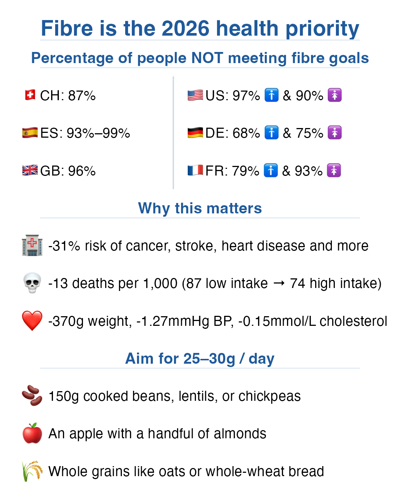

::: {.tldr}
**TLDR.** Most adults miss fibre targets, yet higher intake tracks with lower mortality and cardiometabolic risk. A few food swaps get you most of the way.
:::

If you want a simple, high-impact health priority for 2026, make it fibre. [1]

Most adult guidelines recommend at least 25 g of fibre per day, and some countries use 30 g per day targets. [2][3][4]

Yet most people still fall short:

{fig-alt="Infographic on fibre intake gaps and practical food swaps"}

- Switzerland: 87% do not reach 30 g per day. [5]
- Germany: 68% of men and 75% of women do not reach 30 g per day. [6]
- France: 79% of men and 93% of women do not reach 25 g per day. [7]
- Italy: 88% of adults do not reach the adequate intake for fibre. [8]
- Spain: about 93% to 98.5% of the population is below 25 g per day. [9]
- United Kingdom: 96% of adults do not reach 30 g per day. [4]
- United States: more than 90% of women and 97% of men do not reach recommended fibre intakes. [10]

### Why this matters

- In large evidence syntheses, people with higher fibre intakes had about 15% to 31% lower risk of major outcomes like all-cause mortality, coronary heart disease, stroke, type 2 diabetes, and colorectal cancer, compared with the lowest intakes. [1]
- The same work translates that to about 13 fewer deaths per 1,000 people over the study follow-up periods (low versus high fibre intake). [1]
- For coronary heart disease, the translation was about 6 fewer cases per 1,000 (low versus high fibre intake), over follow-up. [1]
- In intervention trials, higher fibre intake was associated with small but meaningful shifts in risk markers, including about 0.37 kg lower body weight, about 1.27 mm Hg lower systolic blood pressure, and about 0.15 mmol/L lower total cholesterol. [1]
- Fibre also feeds gut microbes, supporting fermentation products such as short-chain fatty acids, which are linked to gut and metabolic health. [11]

### A practical way to start

Without overthinking it (with grams you can use today):

- Add 150 g cooked lentils, chickpeas, or beans per day: typically about 10 to 12 g of fibre in one move. [12]
- Build one snack around 180 g apple (with skin) plus 30 g almonds: roughly about 7 to 8 g of fibre. [12]
- Swap one refined grain for a whole grain, for example 50 g dry oats (porridge), or 60 g whole-wheat bread (about 2 slices): roughly about 4 to 5 g of fibre. [12]

## References

1. [Reynolds A. et al. Carbohydrate quality and human health. The Lancet, 2019.](https://www.thelancet.com/article/S0140-6736(18)31809-9/fulltext)
2. [EFSA DRVs summary report (dietary fibre 25 g/day), 2017.](https://www.efsa.europa.eu/sites/default/files/2017_09_DRVs_summary_report.pdf)
3. [WHO updated guidelines on fats and carbohydrates, 2023.](https://www.who.int/news/item/17-07-2023-who-updates-guidelines-on-fats-and-carbohydrates)
4. [UK NDNS 2019 to 2023 report](https://www.gov.uk/government/statistics/national-diet-and-nutrition-survey-2019-to-2023/national-diet-and-nutrition-survey-2019-to-2023-report)
5. [Switzerland menuCH fibre findings](https://nutrition.bmj.com/content/7/1/26)
6. [Germany Nationale Verzehrsstudie II](https://www.mri.bund.de/fileadmin/MRI/Institute/EV/NVSII_Abschlussbericht_Teil_2.pdf)
7. [France SU.VI.MAX fibre intake](https://www.cambridge.org/core/services/aop-cambridge-core/content/view/FBFA511AFA5DB011FD25AEA8936A789B/S002966510300003Xa.pdf/dietary_fibre_intake_and_clinical_indices_in_the_french_supplementation_en_vitamines_et_mineraux_antioxydants_suvimax_adult_cohort.pdf)
8. [Italy IV SCAI](https://pmc.ncbi.nlm.nih.gov/articles/PMC12787946/)
9. [Spain ENIDE nutritional evaluation](https://badali.umh.es/assets/documentos/doc/ENIDE_Eval-I.pdf)
10. [Thompson 2021 on US fibre shortfalls](https://pmc.ncbi.nlm.nih.gov/articles/PMC8621412/)
11. [Guo et al. gut microbiota / SCFAs, 2022](https://www.frontiersin.org/journals/nutrition/articles/10.3389/fnut.2022.1003571/full)
12. [USDA FoodData Central](https://fdc.nal.usda.gov/)
