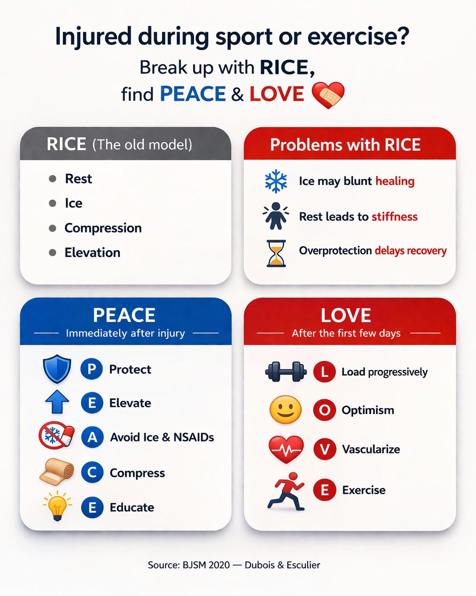

::: {.tldr}
**TLDR.** For acute soft-tissue injuries, PEACE & LOVE is a better evidence-aligned frame than default ice-and-rest RICE.
:::

Injured during sport or exercise? Break up with RICE, and find some PEACE & LOVE.

For decades, RICE (Rest, Ice, Compression and Elevation) has been the default advice for sprains and strains. However, continuing to "ice it and rest" may actually slow recovery rather than support it. [1, 2, 3]

The science has evolved. In 2020, the British Journal of Sports Medicine introduced PEACE & LOVE (Protect, Elevate, Avoid anti-inflammatories, Compress, Educate, then Load, Optimism, Vascularization, Exercise) as a modern, evidence-aligned approach to acute soft-tissue injuries. [3]

{fig-alt="PEACE and LOVE injury recovery framework"}

Across sports medicine and physiotherapy, this framework is increasingly adopted because it focuses not only on early tissue healing, but also on restoring function, confidence, and long-term outcomes. [1, 3, 4]

### Why move on from RICE?

Ice can blunt the inflammatory response needed for tissue repair, so routine icing may delay recovery. [2, 3]

Complete rest promotes stiffness and deconditioning, while early, progressive loading supports recovery. [3, 5]

### Immediately after injury: PEACE

- **Protect** the area, unload for 1 to 3 days to reduce bleeding and aggravation. [3, 5]
- **Elevate** the limb above the heart to help manage swelling. [4, 5]
- **Avoid** anti-inflammatories and ice; allow the natural healing response to occur unless clinically indicated otherwise. [3, 4]
- **Compress** with bandages or taping to limit swelling and provide support. [4, 5]
- **Educate** on recovery expectations, active rehab, and warning signs. [3, 4]

### After the first few days: LOVE

- **Load** progressively, guided by pain, to stimulate tissue repair. [3, 4]
- **Optimism** matters: mindset and expectations influence recovery outcomes. [3, 6]
- **Vascularization** through pain-free cardio supports blood flow and healing. [3, 4]
- **Exercise** to restore mobility, strength, and proprioception. [3, 4]

Updating guidance from RICE to PEACE & LOVE can reduce complications, support faster recovery, and improve long-term outcomes. [3, 4, 5]

## References

1. [PTSMC. Forget RICE, Why PEACE & LOVE is the Modern Approach to Injury Recovery.](https://ptsmc.com/rice-vs-peace-and-love/)
2. [BeBetter Chiro. The New Standard for Soft Tissue Injury, PEACE & LOVE.](https://bebetter-chiro.com.au/the-new-standard-for-soft-tissue-injury-peace-love/)
3. [Dubois B, Esculier J-F. Soft-tissue injuries simply need PEACE and LOVE. British Journal of Sports Medicine, 2020.](https://bjsm.bmj.com/content/54/2/72)
4. [Physiopedia. Peace and Love Principle.](https://www.physio-pedia.com/Peace_and_Love_Principle)
5. [CityMed Physio. PEACE & LOVE patient guide.](https://www.citymedphysio.co.nz/wp-content/uploads/2022/03/PEACE_AND_LOVE.pdf)
6. [MoveWell Injury Clinic. Understanding the PEACE & LOVE protocol.](https://www.movewellinjuryclinic.com/post/understanding-the-peace-love-protocol-for-soft-tissue-injuries)
