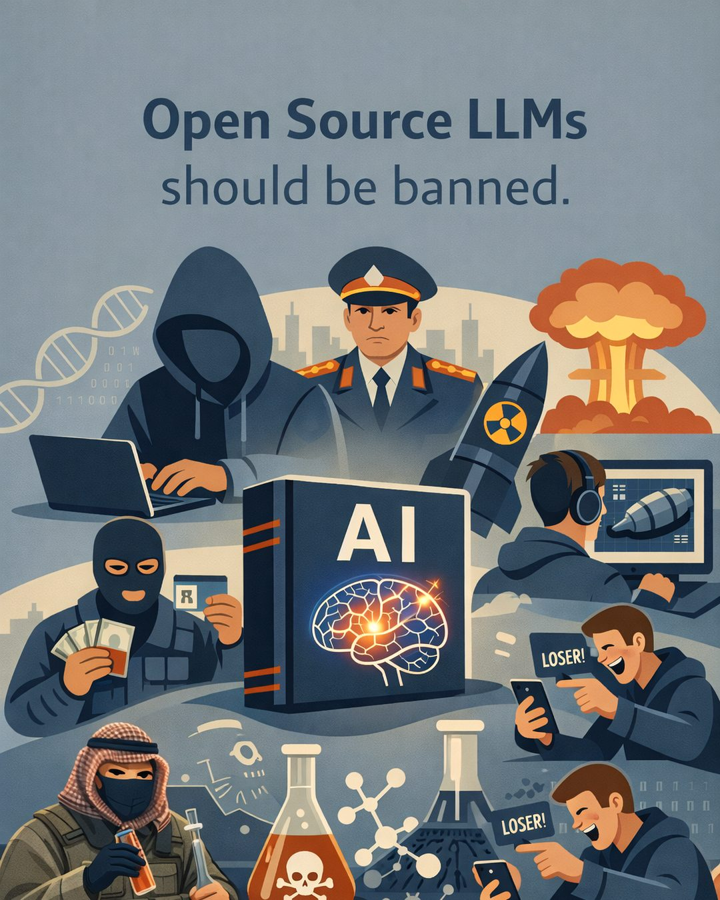

::: {.tldr}
**TLDR.** Frontier open-source and open-weight LLMs should be treated like other high-consequence technologies: licensed access, controlled distribution, evaluation, and accountability.
:::

Open Source and Open Weight Large Language Models (LLMs) should be banned and heavily regulated. [1]

Not because openness is "bad", but because releasing powerful model weights without control creates a safety gap that policy and law enforcement cannot close fast enough. [2]

{fig-alt="Graphic on open-weight LLM risk and regulation"}

Here is the uncomfortable part: these systems can be misused at scale, both intentionally and unintentionally. [2][3]

- Criminals can use them for identity theft, impersonation, blackmail, and fraud. [2]
- Hackers and cybercrime groups can scale phishing, social engineering, and cyberattacks, especially when safeguards are removed from open-weight models. [2]
- Dictators and state actors can use them for propaganda, censorship, and mass persuasion. [4][5]
- Terrorists and violent extremists could exploit biology-related assistance that lowers barriers to harmful planning. [3][6]
- Criminal networks could use chemistry-related help for illicit drug production or handling dangerous substances. [3]
- Bullies can amplify harassment and targeted humiliation at scale. [2]

We already accept that high-risk capabilities are restricted.

- Nuclear technology is tightly governed under the International Atomic Energy Agency (IAEA) and the Treaty on the Non-Proliferation of Nuclear Weapons (NPT). [7]
- Chemical weapons are banned under the Chemical Weapons Convention (CWC), enforced by the Organisation for the Prohibition of Chemical Weapons (OPCW). [8]
- Chemical and biological precursors are controlled through export regimes like the Australia Group (AG). [9]
- In everyday life, we lock up weapons and keep dangerous products away from children.

Prominent voices have warned about open release of frontier systems.

- Dame Wendy Hall, United Nations adviser on Artificial Intelligence, called open sourcing Artificial General Intelligence (AGI) before regulation "really very scary". [1]
- Yoshua Bengio, Turing Award laureate, has argued that catastrophic risk justifies restricting access to the most dangerous systems. [6]
- Geoffrey Hinton, AI pioneer, has warned that advanced Artificial Intelligence can be misused and requires serious regulation. [5]
- The United Kingdom Artificial Intelligence Safety Institute (UK AISI) has warned that safeguards can be removed quickly from open-weight models. [2]
- OpenAI has supported banning access to certain People's Republic of China (PRC) affiliated models on national security grounds. [10]

My take: we should treat frontier open-source and open-weight LLMs like other high-consequence technologies: licensed access, controlled distribution, mandatory evaluation, and accountability.

## References

1. [The Guardian (19 Jan 2024), Wendy Hall on open sourcing AGI](https://www.theguardian.com/technology/2024/jan/19/mark-zuckerberg-artificial-general-intelligence-system-alarms-experts-meta-open-source)
2. [UK AISI. Managing risks from increasingly capable open-weight AI systems (29 Aug 2025)](https://www.aisi.gov.uk/blog/managing-risks-from-increasingly-capable-open-weight-ai-systems)
3. [NIST AI 800-1. Updated Guidelines for Managing Misuse Risk for Dual-Use Foundation Models (15 Jan 2025)](https://www.nist.gov/news-events/news/2025/01/updated-guidelines-managing-misuse-risk-dual-use-foundation-models)
4. [EEAS 3rd Report on Foreign Information Manipulation and Interference (31 Mar 2025)](https://www.eeas.europa.eu/sites/default/files/documents/2025/EEAS-3nd-ThreatReport-March-2025-05-Digital-HD.pdf)
5. [Reuters interview with Geoffrey Hinton (5 May 2023)](https://www.reuters.com/technology/ai-pioneer-says-its-threat-world-may-be-more-urgent-than-climate-change-2023-05-05/)
6. [Yoshua Bengio. FAQ on Catastrophic AI Risks (24 Jun 2023)](https://yoshuabengio.org/2023/06/24/faq-on-catastrophic-ai-risks/)
7. [IAEA overview of the NPT](https://www.iaea.org/publications/documents/treaties/npt)
8. [OPCW overview of the Chemical Weapons Convention](https://www.opcw.org/chemical-weapons-convention)
9. [Australia Group](https://www.dfat.gov.au/publications/minisite/theaustraliagroupnet/site/en/index.html)
10. [TechCrunch on OpenAI policy proposals regarding PRC-affiliated models (13 Mar 2025)](https://techcrunch.com/2025/03/13/openai-calls-deepseek-state-controlled-calls-for-bans-on-prc-produced-models/)
