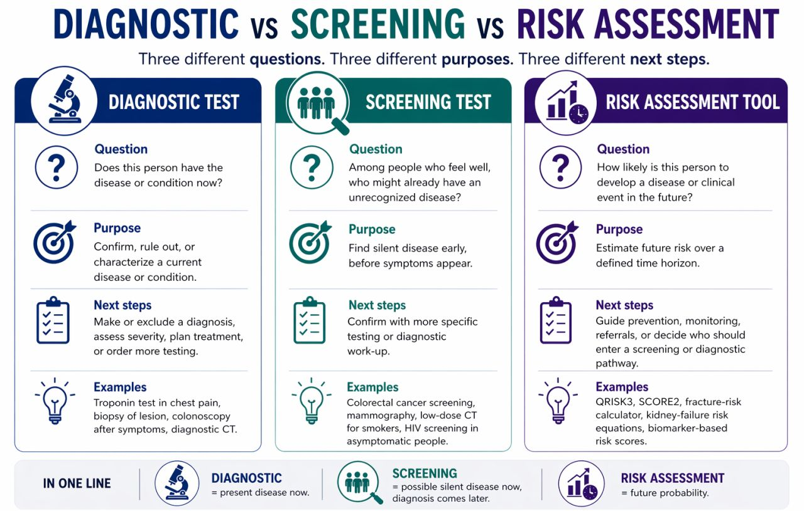

::: {.tldr}
**TLDR.** Diagnostic tests ask about disease now, screening asks who needs follow-up among people who feel well, and risk tools estimate future probability. Mixing them confuses evidence and product strategy.
:::

During my ongoing pitches to investors (VCs and angels), I have realized how much confusion there is around three terms: diagnostic test, screening test, and risk assessment tool.

And to be fair, I suspect this is not limited to investors; many scientists and doctors also use them interchangeably.

This distinction matters a lot. For founders, clinicians, scientists, VCs, and angels, mixing these categories up creates confusion around evidence, clinical utility, regulatory strategy, and how a product will actually be used in practice.

Here is the simplest way to separate them:

{fig-alt="Diagram separating diagnostic tests, screening tests, and risk assessment tools"}

### Diagnostic test

Asks: "Does this person have the disease or condition now?" [1]

It is usually used when someone already has symptoms, signs, or an earlier abnormal result that needs clarification. Its purpose is to confirm, rule out, or characterize a current disease or condition. [1]

Typical next steps include making or excluding a diagnosis, assessing severity, planning treatment, or ordering additional confirmatory testing.

Examples include troponin testing in a person with chest pain, biopsy of a suspicious lesion, colonoscopy after symptoms or another abnormal finding, or diagnostic CT. [1]

### Screening test

Asks: "Among people who feel well, who might already have an unrecognized disease and therefore need diagnostic follow-up?" [2][3][4]

It is used in an apparently healthy, asymptomatic population to detect possible silent disease before symptoms appear. A positive screening result is usually not the final diagnosis; it generally leads to more specific confirmatory testing. [2][3][4]

Typical next steps include imaging, biopsy, laboratory confirmation, or another diagnostic work-up.

Examples include stool-based colorectal cancer screening, screening mammography, low-dose CT in eligible smokers, or HIV screening in asymptomatic people. [2][3][4]

### Risk assessment tool

Asks: "How likely is this person to develop a disease or clinical event in the future?" [5]

It is best understood as a prognostic or risk prediction tool. It is not mainly asking whether a disease is present now; instead, it estimates the probability of a future outcome over a defined time horizon, such as 5 years, 10 years, or lifetime risk. [5]

Typical next steps include intensifying prevention, repeating testing earlier, starting closer monitoring, referring for more evaluation, or deciding who should enter a screening or diagnostic pathway.

Examples include QRISK3, SCORE2, fracture-risk calculators, kidney-failure risk equations, or future disease-risk scores based on biomarkers and questionnaire data. [5]

### In one line

- Diagnostic = present disease now. [1]
- Screening = possible silent disease now, diagnosis comes later. [2][3][4]
- Risk assessment = future probability. [5]

## References

1. [National Cancer Institute, Diagnostic test](https://www.cancer.gov/publications/dictionaries/cancer-terms/def/diagnostic-test)
2. [National Cancer Institute, Screening test](https://www.cancer.gov/publications/dictionaries/cancer-terms/def/screening-test)
3. [National Cancer Institute, Cancer Screening Overview (PDQ)](https://www.cancer.gov/about-cancer/screening/patient-screening-overview-pdq)
4. [World Health Organization Europe, Screening](https://www.who.int/europe/teams/ncd-management/screening)
5. [NICE, Developing review questions and planning the evidence review](https://www.nice.org.uk/process/pmg20/chapter/developing-review-questions-and-planning-the-evidence-review)
