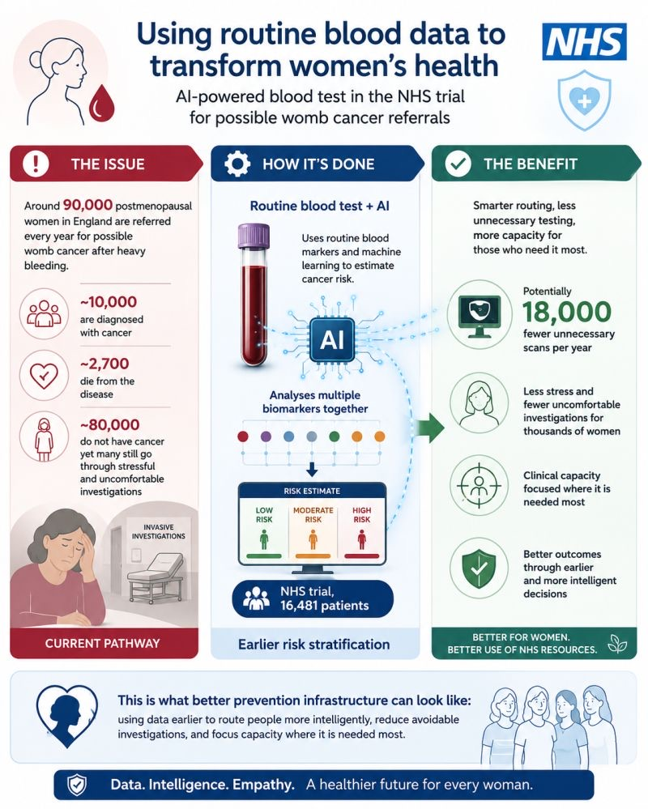

::: {.tldr}
**TLDR.** An NHS AI blood-test trial aims to route fewer women into unnecessary womb-cancer investigations. Prevention has two jobs: act earlier, and route smarter when diagnostics are needed.
:::

{fig-alt="Infographic on an NHS AI blood-test trial for possible womb cancer referrals, showing the issue, how routine blood markers plus AI estimate risk, and benefits including fewer unnecessary scans"}

The next preventive-health breakthrough may be learning to read routine blood data before the system reaches for invasive procedures.

The Guardian reports that around 90,000 postmenopausal women in England are referred every year for possible womb cancer after heavy bleeding. Around 10,000 are diagnosed, and around 2,700 die from the disease [1].

That also means roughly 80,000 women ultimately do not have cancer, yet many still go through stressful and uncomfortable investigations under the current pathway.

Now, an AI-powered blood test is being trialled in the NHS to help reduce this burden [1].

- The test uses routine blood markers and machine learning to estimate cancer risk [1-3]
- It analyses multiple biomarkers together, rather than treating each blood marker in isolation [2]
- The Guardian reports that the trial involved 16,481 patients, including 3,313 women referred for possible womb cancer [1]
- The Guardian reports that the test could spare around 18,000 women per year in England from unnecessary transvaginal ultrasound scans, if implemented as expected [1]
- Cancer Research UK called the test promising, while also saying more research is needed to understand benefits for patients and the NHS [1]

This is what better prevention infrastructure can look like: using data earlier to route people more intelligently, reduce avoidable investigations, and focus capacity where it is needed most.

At Idunox, we are working from the same belief, but one step earlier.

The NHS trial is showing how routine blood data could help route fewer people into unnecessary diagnostic procedures.

Our bigger goal is upstream: to help people understand the direction their health may be moving years before symptoms appear, so they have more time to change course through lifestyle and clinical factors they can still influence.

Then, for the smaller group whose profile may suggest a more urgent concern, the same logic can support smarter routing toward the right diagnostic follow-up.

In other words, true prevention has two jobs:

- Act early enough that fewer people ever reach the diagnostic pathway.
- And when someone does need that pathway, help route them there faster and more intelligently.

## References

1. The Guardian, "Thousands of women could be spared painful cancer exam by new NHS AI blood test," 08 July 2026.
2. PinPoint Data Science, "The PinPoint Test," company information page.
3. Neal M. et al., "Real-World Validation of PinPoint Blood Tests in the NHS," 2026.
