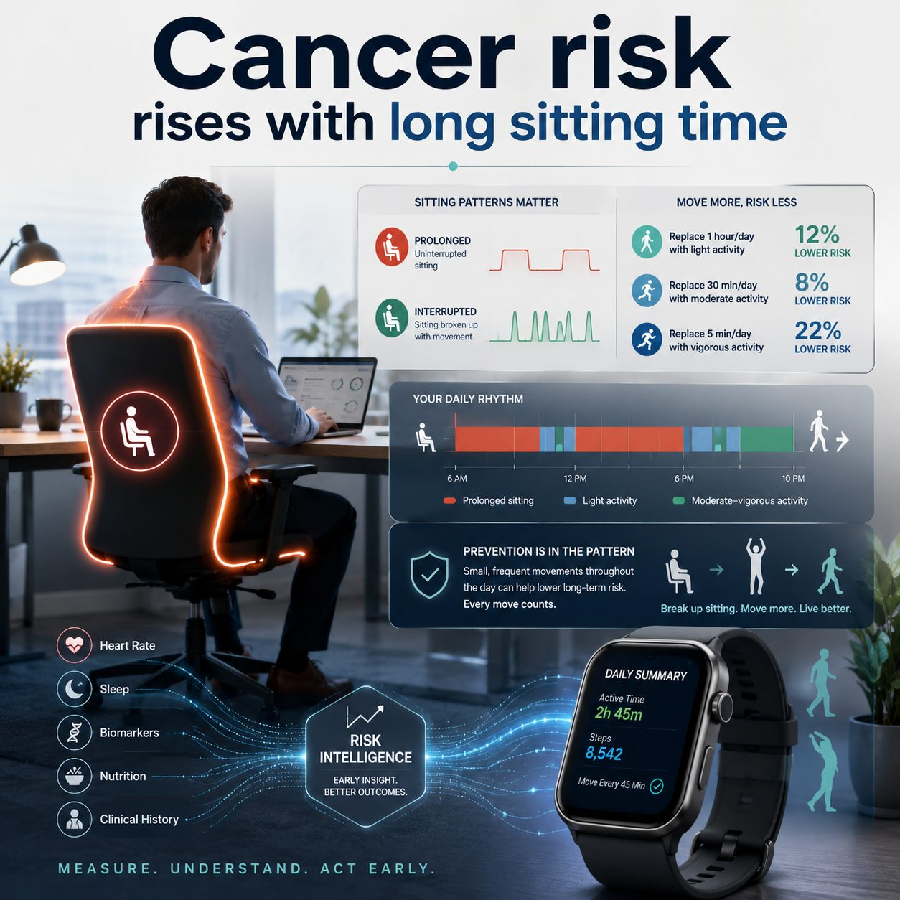

Your cancer risk rises with long sitting time.

A new PLOS Medicine study followed 91,292 UK Biobank participants with wearable accelerometer data for a median of 12.38 years [1].

The researchers found that each additional hour per day of prolonged, uninterrupted sedentary behavior was associated with a higher hazard of cancer death [1].

That does not mean sitting "causes cancer."

This was an observational study, and the authors clearly note limitations, including residual confounding, healthy volunteer bias, and only 7 days of accelerometer measurement [1].

But the risk signal is still hard to ignore:

{fig-alt="Infographic on prolonged sitting and cancer risk"}

**Pattern matters.** The study looked not only at total sedentary time, but also at whether sitting came in long uninterrupted blocks or shorter interrupted periods [1].

**Light movement matters.** Replacing 1 hour per day of prolonged sedentary behavior with light physical activity was associated with a 12% lower hazard of cancer death [1].

**Intensity is not the only story.** Replacing 30 minutes with moderate activity was associated with an 8% lower hazard, and replacing 5 minutes with vigorous activity was associated with a 22% lower hazard of cancer death [1].

**Wearables matter.** This kind of research shows why real-world activity patterns can become part of long-term risk intelligence, alongside biomarkers, blood tests, sleep, nutrition, and clinical history [1].

**Risk is pattern recognition.** The better we understand the invisible rhythms of daily life, the earlier we may be able to spot risk and open a prevention window before symptoms appear.

For me, this is one of the most important shifts in preventive health: the future of health may be hidden in very ordinary moments.

We should ask ourselves: "How does my day accumulate risk?"

That requires measurement, interpretation, and follow-up.

So get a wearable, or set a simple alarm every 45 minutes to remind yourself to move.

## References

1. [Zhou Z. et al. Accelerometry-measured prolonged and interrupted sedentary behavior and cancer incidence and mortality. PLOS Medicine, 2026.](https://journals.plos.org/plosmedicine/article?id=10.1371/journal.pmed.1004767)
2. [Medical Xpress. Long sitting bouts linked to increased cancer risk.](https://medicalxpress.com/news/2026-07-bouts-linked-cancer.html)
