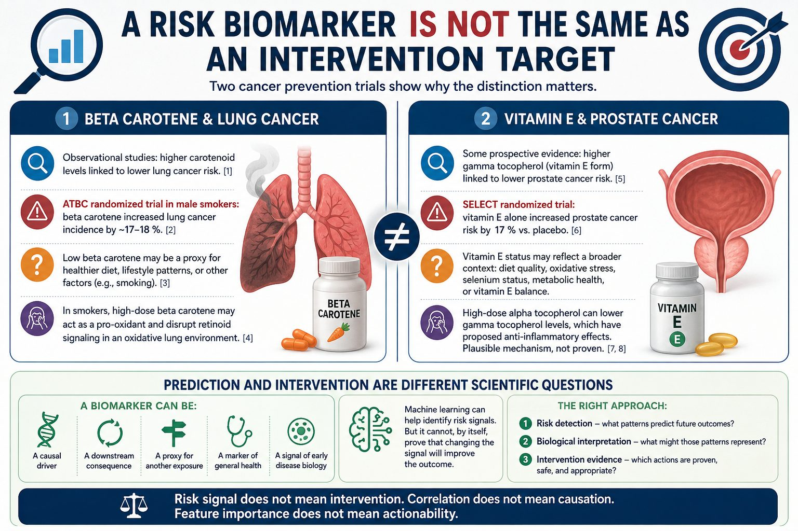

::: {.tldr}
**TLDR.** A risk biomarker is not automatically an intervention target. ATBC and SELECT show how acting on observational signals can harm.
:::

A biomarker of disease risk is not the same as an intervention target.

Two cancer prevention trials make the point painfully clear [2, 6].

{fig-alt="Illustration separating risk detection, biological interpretation, and intervention evidence"}

### 1. Beta carotene and lung cancer

Observational studies found that people with higher blood concentrations of several carotenoids and retinol often had lower lung cancer risk [1]. So, should people take supplements to reduce their risk?

That is what randomized supplementation trials tested. In ATBC, a large randomized trial in male smokers, beta carotene supplementation increased lung cancer incidence by about 17 to 18 percent [2].

One possible explanation is that low beta carotene was not the root cause. It may have been a proxy for a broader context, such as higher fruit and vegetable intake, healthier lifestyle patterns, or residual confounding by smoking [3].

In smokers, high dose beta carotene may also behave differently because cigarette smoke creates a highly oxidative lung environment. Proposed mechanisms include oxidative beta carotene metabolites, pro-oxidant effects, and altered retinoid signaling [4].

### 2. Vitamin E and prostate cancer

Some prospective evidence suggested that higher gamma tocopherol, one form of vitamin E, was associated with lower prostate cancer risk [5].

But SELECT, a large randomized placebo-controlled trial, found that men taking vitamin E alone had a statistically significant 17 percent relative increase in prostate cancer compared with placebo [6].

One possible explanation for the observational signal is that vitamin E status reflected a broader biological context, such as diet quality, oxidative stress, selenium status, metabolic health, or the balance between different vitamin E forms.

SELECT used high dose alpha tocopherol. Alpha tocopherol supplementation can reduce gamma tocopherol levels, and gamma tocopherol has proposed anti-inflammatory and anti-nitrosative effects [7, 8].

### The better question

If a biomarker is a risk factor, the right question is not automatically:

"How do we push this biomarker up or down?"

The better question is:

"What does this biomarker represent, and is there independent evidence that acting on it is safe and beneficial?"

This is why at Idunox, I am very careful to separate these concepts for our customers:

- Risk detection: what patterns predict future outcomes?
- Biological interpretation: what might those patterns represent?
- Intervention evidence: which actions are proven, safe, and appropriate?

Risk signal does not mean intervention.

Correlation does not mean causation.

Feature importance does not mean actionability.

## References

1. Abar et al., Blood concentrations of carotenoids and retinol and lung cancer risk
2. The ATBC Cancer Prevention Study Group, Vitamin E and beta carotene supplementation in male smokers
3. Gallicchio et al., Carotenoids and the risk of developing lung cancer, systematic review
4. Goralczyk, Beta carotene and lung cancer in smokers
5. Huang et al., Prospective study of antioxidant micronutrients in blood and prostate cancer risk
6. Klein et al., Vitamin E and prostate cancer risk, SELECT
7. Huang et al., Alpha tocopherol supplementation reduces gamma and delta tocopherol in humans
8. Jiang et al., Gamma tocopherol, the major form of vitamin E in the US diet, deserves more attention
