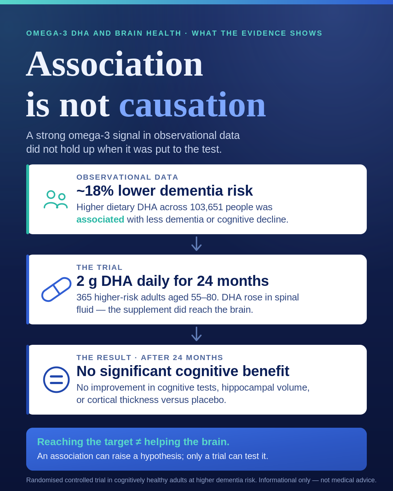

::: {.tldr}
**TLDR.** A two-year DHA trial raised brain DHA without improving cognition or brain structure. Association is not causation, and target engagement is not clinical benefit.
:::

Omega-3 supplementation did not improve cognition or brain structure in a two-year study.

This shows why association and causation are not the same thing.

{fig-alt="Summary graphic for the DHA brain delivery trial"}

### What the trial found

Researchers assigned 365 cognitively unimpaired adults aged 55-80 to receive 2 g of DHA daily or placebo for 24 months. Participants had low baseline DHA intake and at least one dementia risk factor. [1, 2]

Almost half carried APOE ε4, the strongest common genetic risk factor for late-onset Alzheimer's disease. [1]

After six months, DHA increased significantly in cerebrospinal fluid. [1]

Yet after 24 months, the DHA group did not perform better on cognitive tests, with no significant benefit for hippocampal volume or cortical thickness. [1]

### Where did the connection begin?

DHA is an important component of neuronal membranes, with plausible roles in brain function and inflammation. [2, 3]

A 2023 analysis of 48 longitudinal studies involving 103,651 people found that higher dietary DHA intake was associated with an approximately 18% lower risk of dementia or cognitive decline. [3]

This created a plausible hypothesis: higher DHA exposure is associated with better brain ageing, so supplementation should protect cognition. But association is not causation.

People with higher omega-3 intake may also exercise more, eat better, smoke less, have better cardiometabolic health, and differ in education, income, and healthcare access.

DHA may be protective, but it may also mark a healthier lifestyle.

### What does the trial teach us?

Observational associations can generate hypotheses, but cannot prove an isolated intervention will work.

Target engagement shows that an intervention reached its biological target. It does not prove clinical benefit.

Lifelong omega-3 exposure, an overall dietary pattern, and high-dose supplementation started later in life are different interventions.

The trial had limitations: 38% dropped out because of the COVID-19 pandemic, and both groups experienced little cognitive decline. [1]

It does not prove that DHA or omega-3-rich foods are irrelevant to brain health.

It does weaken the claim that high-dose DHA taken for two years preserves cognition in cognitively healthy older adults at increased risk.

A Cochrane review of three trials, including about 3,000 participants, also found no cognitive benefit from omega-3 supplementation in cognitively healthy older adults. [4]

### What does this mean for you?

For researchers: observational evidence is the start of an investigation, not proof. Biomarker movement must be separated from meaningful clinical benefit.

For supplement consumers: raising DHA levels has not been proven to preserve cognition. This trial does not support high-dose DHA specifically to prevent cognitive decline in cognitively healthy older adults.

Anyone considering changing a supplement used for a medical purpose should speak with a qualified healthcare professional.

## References

1. [Yassine HN. et al. CNS target engagement of high dose DHA supplementation in older adults at risk for dementia. eBioMedicine, 2026.](https://doi.org/10.1016/j.ebiom.2026.106316)
2. [ClinicalTrials.gov. DHA Brain Delivery Trial, PreventE4 (NCT03613844).](https://clinicaltrials.gov/study/NCT03613844)
3. [Wei BZ. et al. The relationship of omega-3 fatty acids with dementia and cognitive decline. American Journal of Clinical Nutrition, 2023.](https://doi.org/10.1016/j.ajcnut.2023.04.001)
4. [Sydenham E. et al. Omega-3 fatty acid for the prevention of cognitive decline and dementia. Cochrane Database of Systematic Reviews, 2012.](https://doi.org/10.1002/14651858.CD005379.pub3)
