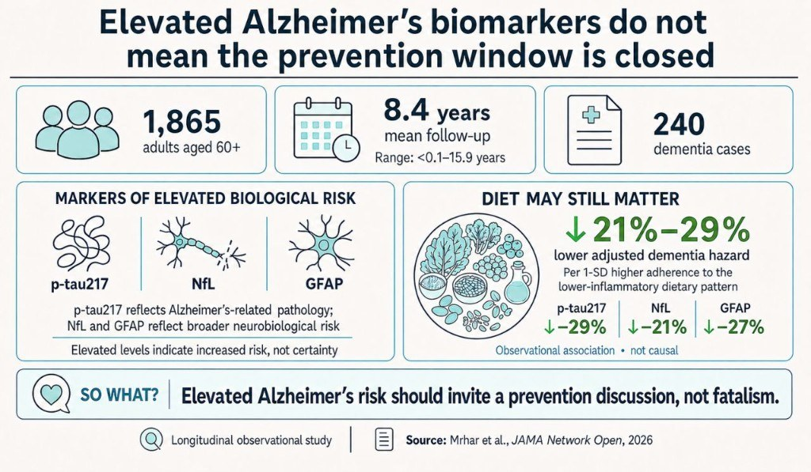

::: {.tldr}
**TLDR.** Elevated Alzheimer's blood biomarkers do not close the prevention window. In a Swedish cohort, higher-quality and lower-inflammatory diets still tracked with lower dementia risk, as observational associations.
:::

{fig-alt="Infographic summarizing a study of 1,865 adults where lower-inflammatory diet adherence tracked with 21 to 29 percent lower adjusted dementia hazard among people with elevated p-tau217, NfL, or GFAP"}

Elevated Alzheimer's biomarkers do not mean the prevention window is closed.

A new longitudinal study suggests that diet quality may remain relevant even among older adults with elevated blood biomarkers linked to Alzheimer's pathology and neurodegeneration. [1, 2]

Researchers followed 1,865 dementia-free adults aged 60+ in the Swedish National Study on Aging and Care in Kungsholmen. Mean age at baseline was 70.5 years. Mean follow-up was 8.4 years (range: <0.1-15.9), and 240 participants developed dementia. [1]

The biomarkers examined were:

- p-tau217: Alzheimer's-related tau pathology
- NfL: neuronal injury
- GFAP: astrocyte activation or damage [1]

### What did they find?

Across the full cohort, higher-quality dietary patterns were associated with lower dementia risk. [1, 2]

Among participants with elevated biomarkers, the lower-inflammatory dietary pattern showed the most consistent inverse associations. Per 1-SD higher adherence, adjusted dementia hazard was 29% lower with elevated p-tau217, 21% lower with elevated NfL and 27% lower with elevated GFAP. These were observational associations, not causal effects. [1]

### The wider evidence is supportive but mixed

WHO's 2026 guideline includes healthy diet within dementia-risk-reduction recommendations. [3]

A Mediterranean-diet trial reported more favourable changes in certain cognitive outcomes with extra-virgin olive oil or nuts than with a control diet. [4]

A larger three-year trial found no significantly greater cognitive improvement with the MIND diet than with a control diet involving mild calorie restriction. [5]

### What the evidence supports

- A healthy, balanced diet is a guideline-supported component of dementia risk reduction.
- Diet may remain relevant after biological risk becomes visible.

### What it does not prove

- Diet prevents Alzheimer's dementia.
- Changing diet after biomarker elevation will prevent dementia.
- A lower-inflammatory diet reverses pathology or neutralises biological risk.

Earlier risk insight should open a structured prevention conversation, not fatalism or promises the evidence cannot support.

## References

1. [Mrhar et al., JAMA Network Open, 2026](https://jamanetwork.com/journals/jamanetworkopen/fullarticle/2850780)
2. [Anderer, JAMA, 2026](https://jamanetwork.com/journals/jama/fullarticle/2851946)
3. [WHO guideline, 2026](https://www.who.int/publications/i/item/9789240123557)
4. [Valls-Pedret et al., JAMA Internal Medicine, 2015](https://jamanetwork.com/journals/jamainternalmedicine/fullarticle/2293082)
5. [Barnes et al., NEJM, 2023](https://www.nejm.org/doi/full/10.1056/NEJMoa2302368)
