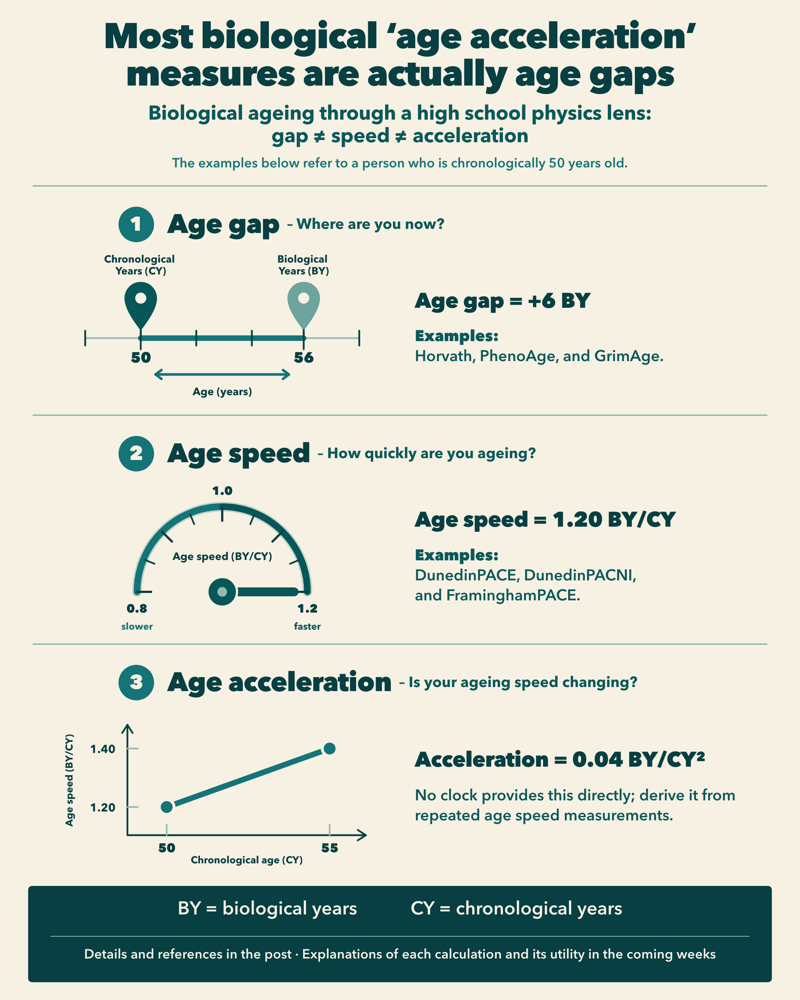

High school physics explains why the entire field of biological ageing may be using the word "acceleration" for the wrong thing.

For many biological age clocks, "age acceleration" is used to describe the difference between predicted biological age and chronological age, or a residual after predicted age has been adjusted for chronological age [1, 2].

But mathematically, these quantities describe a deviation from an age reference.

Following high school physics, that is an age gap, not acceleration.

DunedinPACE is different. It was designed to estimate the pace of ageing, calibrated so that a value of 1.0 represents a reference pace of approximately one biological year of physiological change per chronological year [3].

Following the high school physics analogy, that is closer to what we could call age speed.

Here is the difference between gap, speed and acceleration:

{fig-alt="Infographic comparing age gap, age speed, and age acceleration"}

### Age gap: where are you now?

Imagine that you are 50 years old, but a biological age clock estimates your age as 56.

Age gap = 56 minus 50 = +6 years

According to that specific clock, your biology appears approximately six years older than your chronological age.

For this illustration, the unit is biological years, abbreviated as BY.

Examples of clocks commonly analysed through age-gap or age-residual measures include the Horvath clock, PhenoAge and GrimAge [6-8].

However, that age gap might change over time.

### Speed: how quickly are you ageing?

Imagine that your ageing speed is 1.20 biological years per chronological year.

This means that your ageing speed is 20% above the reference speed [3].

The unit is biological years per chronological year, abbreviated as BY/CY for this illustration.

Examples of measures designed to estimate relative pace of ageing include DunedinPACE, DunedinPACNI and FraminghamPACE [3, 9, 10].

However, that ageing speed might also change over time.

### Acceleration: is your speed changing?

Imagine that your ageing speed was 1.20 BY/CY at age 50, but increased to 1.40 BY/CY by age 55.

Over those five years, your ageing speed increased by:

1.40 minus 1.20 = 0.20 BY/CY

Averaged over those five years, your ageing acceleration would be:

0.20 BY/CY divided by 5 CY = 0.04 BY/CY²

Therefore, the unit is biological years per chronological year squared, abbreviated as BY/CY² for this illustration.

This is closer to acceleration in the physics sense, the rate at which speed changes [5].

Longitudinal modelling provides a way to study such changing trajectories [11]. Using repeated methylation measurements, Kuo et al. reported that the rates of change in GrimAge and DunedinPACE increased with age [12].

Other research fields already use clearer terminology. Brain-age research, for example, commonly describes the difference between predicted brain age and chronological age as the "brain age gap" or "brain-predicted age difference" [4].

So, the next time you read "age acceleration", remember that, for many conventional biological age clocks, it is actually an age gap.

Over the next few weeks, I will explain how we can measure each term - age gap, age speed and age acceleration - and which one is most useful in each scenario.

## References

1. [Chervova O. et al. Evaluation of Epigenetic Age Acceleration Scores and Their Associations with CVD-Related Phenotypes in a Population Cohort.](https://pmc.ncbi.nlm.nih.gov/articles/PMC9855929/)
2. [Chen BH. et al. DNA methylation-based measures of biological age: meta-analysis predicting time to death.](https://pmc.ncbi.nlm.nih.gov/articles/PMC5076441/)
3. [Belsky DW. et al. DunedinPACE, a DNA methylation biomarker of the pace of aging.](https://pmc.ncbi.nlm.nih.gov/articles/PMC8853656/)
4. [Cole JH. et al. Brain age and other bodily "ages": implications for neuropsychiatry.](https://pmc.ncbi.nlm.nih.gov/articles/PMC6344374/)
5. [OpenStax. Acceleration, Physics.](https://openstax.org/books/physics/pages/3-1-acceleration)
6. [Horvath S. DNA methylation age of human tissues and cell types.](https://pmc.ncbi.nlm.nih.gov/articles/PMC4015143/)
7. [Levine ME. et al. An epigenetic biomarker of aging for lifespan and healthspan.](https://pmc.ncbi.nlm.nih.gov/articles/PMC5940111/)
8. [Lu AT. et al. DNA methylation GrimAge strongly predicts lifespan and healthspan.](https://pmc.ncbi.nlm.nih.gov/articles/PMC6366976/)
9. [Whitman ET. et al. DunedinPACNI estimates the longitudinal Pace of Aging from a single brain image to track health and disease.](https://pmc.ncbi.nlm.nih.gov/articles/PMC12350157/)
10. [Marella WT. et al. An epigenetic speedometer to measure Pace of Aging: FraminghamPACE.](https://pmc.ncbi.nlm.nih.gov/articles/PMC13370530/)
11. [Großbach A. et al. Maximizing insights from longitudinal epigenetic age data.](https://pmc.ncbi.nlm.nih.gov/articles/PMC11662605/)
12. [Kuo P-L. et al. Longitudinal changes in epigenetic clocks predict survival in the InCHIANTI cohort.](https://pmc.ncbi.nlm.nih.gov/articles/PMC13004684/)
