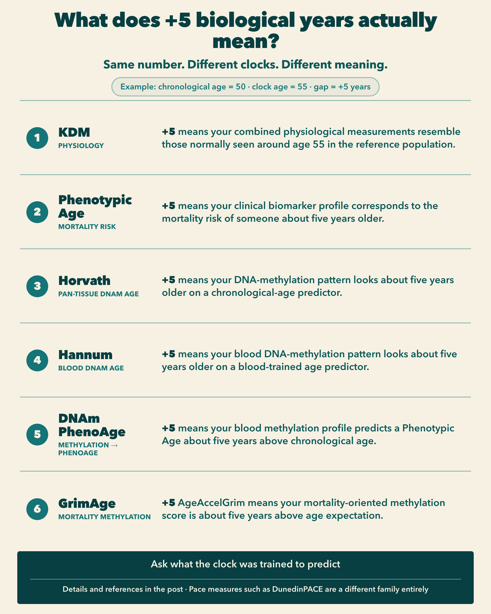

In a [previous note](../2026-08-01-age-acceleration/), I argued that many "age acceleration" scores are really age gaps: the difference between a clock age and chronological age, or a residual after adjusting clock age for chronological age.

This follow-up asks a more practical question: if two people are both chronologically 50, and one clock returns 45 while another returns 55, what do those five-year gaps actually mean?

Imagine two people.

Both are chronologically 50 years old.

A biological age clock gives one of them an estimated age of 45 and the other an estimated age of 55.

The obvious calculation is:

Age gap = estimated biological age − chronological age

So their age gaps are:

45 − 50 = −5

and

55 − 50 = +5

The first person appears five years younger. The second appears five years older.

Simple.

Except for one important problem:

**five biological years does not mean the same thing in every clock.**

A +5-year Horvath age gap, a +5-year Phenotypic Age gap and a +5-year GrimAge gap are not three independent measurements of the same biological quantity.

They use different inputs.

They were trained against different targets.

And the resulting number represents something different.

{fig-alt="Infographic comparing what a +5 year age gap means across KDM, Phenotypic Age, Horvath, Hannum, DNAm PhenoAge, and GrimAge"}

Here are the major age-gap clocks and what their numbers actually mean.

## At a glance

| Clock | What you need | What it returns | What the age represents |
| --- | --- | --- | --- |
| **KDM Biological Age** | Age + physiological/clinical biomarkers | Age in years | Age at which your physiological profile would be typical in the reference population |
| **Phenotypic Age** | Age + 9 routine blood biomarkers | Age in years | Age associated with your estimated mortality risk |
| **Horvath clock** | DNA methylation, 353 CpGs | DNAm age in years | Age predicted from methylation patterns across tissues |
| **Hannum clock** | Blood DNA methylation, 71 CpGs | DNAm age in years | Age predicted from blood methylation patterns |
| **DNAm PhenoAge** | Blood DNA methylation, 513 CpGs | Age in years | DNA-methylation estimate of Phenotypic Age |
| **GrimAge** | Blood DNA methylation + age + sex | Age in years | Mortality-oriented methylation score transformed onto an age scale |

The important column is the last one.

That is what determines what an age gap actually means.

## 1. KDM Biological Age: "What age normally has physiology like mine?"

One of the classic approaches is the **Klemera–Doubal Method**, or KDM.

Unlike a single fixed clock, KDM is really a statistical framework: researchers choose physiological biomarkers that change systematically with chronological age, learn their age trajectories in a reference population, and combine them to estimate biological age.

A widely used implementation developed from NHANES III data by Morgan Levine used chronological age together with 10 measurements [8]:

- albumin
- alkaline phosphatase
- blood urea nitrogen
- creatinine
- C-reactive protein
- cytomegalovirus optical density
- HbA1c
- total cholesterol
- systolic blood pressure
- forced expiratory volume in one second, or FEV₁

Other implementations use somewhat different panels, which is important: **"KDM Biological Age" does not always mean exactly the same biomarker set.** [1]

### What does the number mean?

KDM can be thought of as asking:

**At what chronological age would this combination of physiological measurements be typical in the reference population?**

If you are 50 and KDM gives you a biological age of 55, the interpretation is approximately:

**your physiological profile resembles the average profile associated with someone around 55 in the reference population.**

That is much more precise than saying:

> "Your body is literally five years older."

It is not.

It is a statistical position on a physiological ageing trajectory. [2]

### The main biases

The biggest limitation is **reference-population dependence**.

The relationship between blood pressure, lung function, blood biomarkers and age is estimated from a particular population. Change the population, historical period or biomarker panel and the biological-age estimate can change. Modern KDM implementations consequently use several different panels. [1]

Chronological age itself is also incorporated into common implementations. Therefore, KDM is not an age-independent reading of physiology.

And because it is based on physiological measurements, medical conditions, medication, inflammation and other transient or chronic processes can influence the result. That is partly the point of the clock, but it also means the number should not be interpreted as a direct measurement of some universal underlying "true age".

## 2. Phenotypic Age: "What age normally has my mortality risk?"

**Phenotypic Age**, often shortened to PhenoAge, looks superficially similar to KDM.

But its training target is fundamentally different.

It was constructed from chronological age plus nine clinical biomarkers:

- albumin
- creatinine
- glucose
- C-reactive protein
- lymphocyte percentage
- mean corpuscular volume
- red-cell distribution width
- alkaline phosphatase
- white-blood-cell count

The researchers started with a larger set of clinical variables and selected these biomarkers using mortality modelling in NHANES III. The resulting mortality estimate was then converted back into units of years. [3]

That last step is crucial.

### What does the number mean?

Phenotypic Age is approximately a **mortality-risk-equivalent age**.

Suppose you are 50 and your Phenotypic Age is 55.

The intended interpretation is:

**your estimated mortality risk corresponds to the average mortality risk associated with a 55-year-old in the reference population.**

That interpretation comes directly from the construction of the clock. [3]

It does **not** mean:

- your organs are literally 55;
- every biological system has aged five extra years;
- you have lost five years of life expectancy;
- or you have been ageing faster throughout your life.

Those are different claims.

### The main biases

Phenotypic Age includes chronological age as an input. So part of a person's Phenotypic Age is deliberately anchored to birthday age. [3]

It is also sensitive to the physiology represented by its biomarkers. CRP and white-blood-cell count, for example, contain inflammatory and immune information; creatinine reflects renal physiology; glucose reflects metabolic state.

Another particularly important bias was visible in the original validation: younger adults tended to receive somewhat overestimated Phenotypic Ages, while older adults tended to receive underestimated values. The researchers therefore defined **PhenoAgeAccel** as the residual after regressing Phenotypic Age on chronological age. [3]

So there are actually two possible numbers:

raw gap = Phenotypic Age − chronological age

and an age-adjusted residual:

PhenoAgeAccel = Phenotypic Age − E(Phenotypic Age | age)

For research comparisons, the second can be preferable because it corrects systematic age-related calibration.

## 3. Horvath clock: "How old does my DNA methylation pattern look?"

In 2013, Steve Horvath introduced what became probably the best-known epigenetic clock.

Instead of clinical blood chemistry, the clock looks at **DNA methylation**.

The model was trained using around 8,000 samples from 82 datasets containing 51 healthy tissue and cell types. Elastic-net regression selected **353 CpG sites** whose weighted methylation pattern predicts chronological age. [4]

### What does it require?

DNA from which methylation at the relevant CpG sites can be measured, generally through a methylation-array experiment.

Unlike Hannum's clock, the major advantage of Horvath's original clock was that it was designed as a **multi-tissue** predictor rather than exclusively as a blood clock. [4]

### What does the number mean?

Suppose you are 50 and your Horvath DNAm age is 55.

The safest interpretation is:

**your methylation pattern at the clock's 353 CpGs resembles the pattern that the model associates with approximately age 55.**

Your raw epigenetic age gap is therefore:

55 − 50 = +5 years

But this is fundamentally different from Phenotypic Age.

Horvath's original clock was trained primarily to **predict chronological age**.

Phenotypic Age was trained around mortality.

Therefore, +5 Horvath years do not mean that you have the mortality risk of someone five years older. [4]

They mean that your methylation clock is advanced relative to your chronological age.

### The main biases

That training objective creates an important limitation.

A clock can be extremely good at predicting chronological age without necessarily being the best predictor of disease, mortality or physiological decline. Chronological-age prediction and health-risk prediction are related questions, but they are not identical.

Methylation estimates can also depend on tissue, cell composition, population characteristics and preprocessing. Horvath's clock was deliberately trained across many tissues, which makes it unusually portable, but accuracy is not identical across every tissue or population. [4]

And, as with other age-prediction models, regression toward the population mean can affect the raw age gap.

## 4. Hannum clock: "How old does my blood methylation look?"

The **Hannum clock** appeared at almost the same time as Horvath's.

The original study analysed whole-blood methylation from 656 people aged 19–101 and developed a model centred on **71 methylation markers** that strongly predicted chronological age. [5]

The conceptual difference from Horvath is straightforward:

**Hannum is fundamentally a blood-derived clock.**

Horvath was designed as a pan-tissue clock.

### What does the number mean?

For a 50-year-old with a Hannum age of 55:

**the person's blood DNA-methylation pattern looks approximately five years older than expected from chronological age.**

Again, this is a molecular age-prediction gap.

It is not directly a five-year difference in mortality risk or life expectancy.

### The main biases

Because it was developed in whole blood, blood-cell composition matters.

The proportions of different immune-cell types change with age and health. Some of that information may itself be biologically meaningful, but it means that the Hannum gap can reflect changes in the cellular composition of blood as well as methylation changes occurring within individual cell types.

The original development population was also much narrower than a globally representative population, consisting primarily of Caucasian and Hispanic participants. [5]

And like Horvath, Hannum is a **first-generation chronological-age clock**.

Its +5 years primarily means "older-looking methylation", not "five years greater mortality-equivalent age".

## 5. DNAm PhenoAge: putting Phenotypic Age into DNA methylation

Then researchers started doing something different.

Instead of asking DNA methylation to predict chronological age, why not ask it to predict a biological phenotype associated with health and mortality?

That produced **DNAm PhenoAge**.

Its development happened in two stages.

First, the clinical Phenotypic Age measure was constructed from chronological age and the nine clinical biomarkers discussed earlier.

Then researchers used blood DNA methylation to predict that Phenotypic Age.

Elastic-net regression selected **513 CpG sites**. [6]

### What does the number mean?

This distinction is subtle but extremely important.

If you are 50 and your DNAm PhenoAge is 55, it does not mean exactly the same thing as having a clinical Phenotypic Age of 55.

Instead:

**your DNA-methylation profile produces a predicted Phenotypic Age of approximately 55 according to the methylation model.**

It is a molecular proxy for a clinical mortality-oriented ageing phenotype. [6]

That makes DNAm PhenoAge a kind of second-generation epigenetic clock.

Horvath:

DNA methylation → chronological age

DNAm PhenoAge:

DNA methylation → Phenotypic Age

The target changed.

And therefore the meaning of the age gap changed too.

### The main biases

DNAm PhenoAge inherits limitations from **both layers** of this process.

The underlying Phenotypic Age target comes from a particular clinical and mortality model.

The methylation clock then learns a proxy for that target.

So the final number is one step removed from the actual clinical biomarkers used to construct Phenotypic Age.

It is also affected by the usual considerations surrounding blood methylation assays, cell composition, cohort differences and technical processing.

Its advantage is precisely the same thing as its limitation: it compresses a much more complicated biological and epidemiological construct into a single blood-DNA measurement. [6]

## 6. GrimAge: "How old does my mortality-related methylation profile look?"

**GrimAge** pushes the idea even further toward health outcomes.

Its developers first created DNA-methylation surrogates for smoking exposure and several plasma proteins.

The final original GrimAge model combines:

- chronological age
- sex
- a DNAm estimate of smoking pack-years
- DNAm surrogates for seven plasma proteins:
  - adrenomedullin
  - beta-2-microglobulin
  - cystatin C
  - GDF-15
  - leptin
  - PAI-1
  - TIMP-1

The methylation surrogates collectively use 1,030 unique CpGs. These variables were then combined using mortality data, and the resulting mortality predictor was transformed into units of years. [7]

Importantly, a person does **not** need to measure those seven proteins individually to calculate DNAm GrimAge. They are estimated from the person's blood DNA-methylation profile. [7]

### What does the number mean?

This is where interpreting the raw age becomes dangerous.

Suppose you are 50 and GrimAge gives 55.

That means your mortality-related methylation composite has been mapped to an age-like value of 55.

But researchers usually focus on **AgeAccelGrim**, which adjusts GrimAge for chronological age. [7]

So a +5 AgeAccelGrim is better interpreted as:

**your GrimAge score is five years higher than expected for someone of your chronological age.**

It does **not** mean:

**you will die five years earlier.**

GrimAge is associated with mortality and multiple age-related outcomes, but its "years" are the scale of a statistical mortality-related biomarker, not a countdown timer. [7]

### The main biases

GrimAge is deliberately sensitive to things associated with mortality.

Smoking is the clearest example: a DNA-methylation estimate of cumulative smoking exposure is built directly into the model. [7]

That is a feature if your aim is to predict mortality risk.

But it also means that GrimAge should not automatically be interpreted as a pure measurement of an intrinsic biological ageing mechanism.

A heavy smoking history can make GrimAge substantially worse because the clock was explicitly designed to contain that information.

Chronological age and sex are also model inputs.

Again, the clock is doing what it was built to do.

The error comes when we interpret its output as something it was never built to measure.

## So what does "+5 biological years" actually mean?

This is the comparison I find most useful.

If a 50-year-old receives a result of 55:

### KDM: +5 years

**"My combined physiological measurements resemble those normally observed at an older age in the reference population."**

### Phenotypic Age: +5 years

**"My clinical biomarker profile corresponds to the mortality risk associated with someone approximately five years older in the reference population."**

### Horvath: +5 years

**"My DNA-methylation pattern looks approximately five years older than my chronological age according to a pan-tissue chronological-age predictor."**

### Hannum: +5 years

**"My blood DNA-methylation pattern looks approximately five years older according to a blood-trained chronological-age predictor."**

### DNAm PhenoAge: +5 years

**"My blood DNA-methylation profile predicts a Phenotypic Age approximately five years above my chronological age."**

### GrimAge: +5 years

More carefully, when using AgeAccelGrim:

**"My mortality-oriented methylation score is approximately five years above what the model expects at my chronological age."**

Those statements sound similar.

Scientifically, they are very different.

## The most important source of bias: what was the clock trained to predict?

We often focus on whether a clock uses blood, DNA, hundreds of CpGs or ten clinical variables.

But perhaps the more important question is:

**What was the target?**

For the original Horvath and Hannum clocks, the target was primarily:

chronological age

For KDM, the aim is closer to:

age-associated physiology

For Phenotypic Age:

mortality-risk-equivalent age

For DNAm PhenoAge:

methylation-predicted Phenotypic Age

And for GrimAge:

mortality-related information expressed on an age scale

This is why comparing clocks solely by asking which one produces the smallest error against chronological age can be misleading.

If the clock was deliberately designed to identify people of the same chronological age who have different mortality risks, deviation from chronological age is not necessarily a mistake.

It may be the information we wanted the clock to find. [3]

## Raw age gap or adjusted age gap?

There is one final complication.

The simplest calculation is:

raw age gap = clock age − chronological age

That is intuitive and useful for explaining a result.

But many clocks show systematic age bias. Young people may be predicted slightly too old, while old people may be predicted slightly too young.

Phenotypic Age showed exactly this pattern in its validation data. [3]

Researchers therefore frequently calculate an age-adjusted residual:

adjusted age gap = clock age − E(clock age | chronological age)

This asks a subtly different question:

**How unusual is my clock value compared with other people of my age?**

For scientific comparisons, that can be much more informative.

It also means that when somebody says their "age acceleration is +5 years", the first question should be:

**+5 according to which clock, and calculated how?**

Without those two pieces of information, the number is almost meaningless.

## There is no single "best" biological age clock

Different clocks answer different questions.

If I wanted a relatively accessible measure based on routine clinical blood tests, **Phenotypic Age** is particularly attractive.

If I wanted to ask where someone's overall physiology lies relative to age-associated population trajectories, **KDM** answers a slightly different question.

If I wanted a molecular measure of age-related DNA methylation across tissues, the **Horvath clock** is historically fundamental.

If I wanted a blood-specific first-generation methylation age, **Hannum** is another classic.

If I wanted DNA methylation tied more closely to physiological ageing, **DNAm PhenoAge** changes the target.

And if prediction of mortality-related outcomes were the priority, **GrimAge** was explicitly built much closer to that objective. [4]

None measures an individual's one true biological age.

They are models.

Each compresses a particular collection of biological observations into an age-like number.

The question is therefore not simply:

**"What is my biological age?"**

A better question is:

**"According to this particular model, what does my biology look older or younger with respect to?"**

Once you ask that, an age gap becomes much easier to interpret.

## One thing that is not an age-gap clock

This distinction also explains why a measure such as **DunedinPACE** does not belong in the table above.

DunedinPACE returns a **pace**, approximately biological years of physiological change per chronological year.

A result around 1.0 is a rate.

It is not an age.

Therefore:

DunedinPACE − chronological age

has no meaningful interpretation.

That is a different family of ageing measure entirely.

And that difference - between **how old you appear now** and **how quickly you are changing over time** - is where I will go next.

## References

1. [Kwon D, Belsky DW. A toolkit for quantification of biological age from blood chemistry and organ function test data: BioAge.](https://pmc.ncbi.nlm.nih.gov/articles/PMC8602613/)
2. [Mak JKL. et al. Clinical biomarker-based biological aging and risk of cancer in the UK Biobank.](https://pmc.ncbi.nlm.nih.gov/articles/PMC10307789/)
3. [Liu Z. et al. A new aging measure captures morbidity and mortality risk across diverse subpopulations from NHANES IV.](https://journals.plos.org/plosmedicine/article?id=10.1371/journal.pmed.1002718)
4. [Horvath S. DNA methylation age of human tissues and cell types.](https://pmc.ncbi.nlm.nih.gov/articles/PMC4015143/)
5. [Hannum G. et al. Genome-wide Methylation Profiles Reveal Quantitative Views of Human Aging Rates.](https://pmc.ncbi.nlm.nih.gov/articles/PMC3780611/)
6. [Levine ME. et al. An epigenetic biomarker of aging for lifespan and healthspan.](https://pmc.ncbi.nlm.nih.gov/articles/PMC5940111/)
7. [Lu AT. et al. DNA methylation GrimAge strongly predicts lifespan and healthspan.](https://pmc.ncbi.nlm.nih.gov/articles/PMC6366976/)
8. [Levine ME. Modeling the Rate of Senescence: Can Estimated Biological Age Predict Mortality More Accurately Than Chronological Age?](https://pmc.ncbi.nlm.nih.gov/articles/PMC3660119/)
