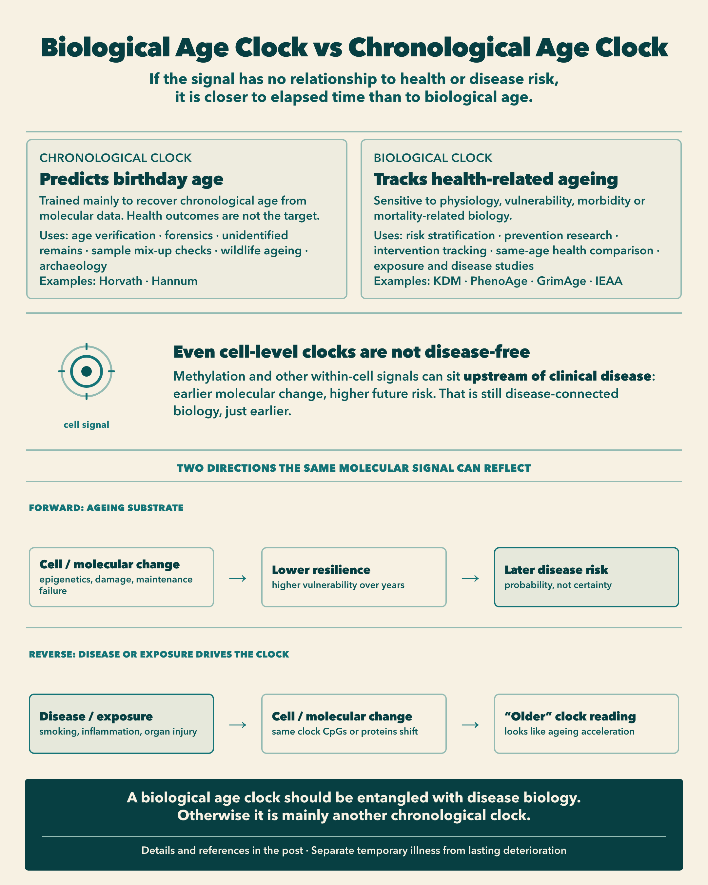

::: {.tldr}
**TLDR.** Asking which biological age clock is "least confounded by disease" sounds rigorous, but it can miss the point. Sensitivity to disease-related physiology is often a feature of a useful biological age measure, not a bug. A clock trained only to predict birthday age, with no relationship to health, morbidity or mortality, is scientifically interesting for forensics, age verification, unidentified remains, sample QC, wildlife ageing and archaeology. It is much less useful for prevention. Temporary illness and lasting deterioration are what we should separate, not ageing and disease biology.
:::

Someone recently asked a fair question about biological age clocks:

**Which one is least confounded by diseases?**

My first reaction was another question:

**Do you think it is bad that they are confounded by diseases?**

In a [previous note](../2026-08-09-biological-age-gap/), I argued that a +5 year gap does not mean the same thing across clocks. Horvath years, Phenotypic Age years and GrimAge years answer different questions. This follow-up pushes that idea one step further.

Before asking which clock is least contaminated by disease, ask what you want the number to represent.

{fig-alt="Infographic titled Biological Age Clock vs Chronological Age Clock, covering early disease-linked cell signals and reverse causality"}

## When disease signal is a feature

Phenotypic Age was constructed from chronological age plus clinical biomarkers such as CRP, glucose and creatinine, selected using mortality modelling. If diabetes, kidney dysfunction or systemic inflammation makes Phenotypic Age older, that is largely what the clock was built to detect. [1]

GrimAge goes further. It incorporates DNA-methylation surrogates for smoking exposure and several plasma proteins, then transforms a mortality-related predictor onto an age scale. [2]

In both cases, calling disease-related physiology a "confounder" is odd.

It may be the signal.

I would personally want a biological age clock to reflect disease-related physiological deterioration. Otherwise it becomes unclear what "biological age" is supposed to represent.

But that does not mean every disease effect is desirable.

## When disease signal is contamination

Imagine someone has an acute infection.

Infection raises CRP and white-blood-cell count. A clinical clock such as Phenotypic Age can look several years older. Two weeks later, after recovery, the estimate drops again.

Did that person age and rejuvenate by several years?

Or did the clock correctly detect a temporary adverse physiological state?

That distinction matters.

A similar issue appears with chronic organ pathology. If someone develops kidney disease and creatinine rises, a clinical clock may become older. That is useful if the question is:

**What is this person's current age-related health or risk state?**

It is less satisfying if the question is:

**How advanced is the underlying ageing process, independently of current diseases?**

Those are different constructs.

## Four things a clock can try to measure

Before ranking clocks, it helps to separate the target:

| Construct | Rough question | Classic examples |
| --- | --- | --- |
| **Intrinsic ageing** | How old do cells look after holding cell mix constant? | IEAA |
| **Current physiology** | How old does present physiology look relative to age trajectories? | KDM |
| **Mortality risk** | How old does mortality-related biology look? | Phenotypic Age, GrimAge |

Phenotypic Age uses clinical biomarkers, so it can look similar to a physiology clock. Its training target is still mortality risk, not typical age-associated physiology. [1]

Pace measures such as DunedinPACE answer a different question again: how quickly multi-system physiology has been changing. [11] That construct matters, but it is not an age-gap clock.

Once you choose the construct, "confounding by disease" becomes easier to interpret.

Disease physiology is unwanted contamination if the target is a disease-independent intrinsic process.

It may be exactly the signal you want if the target is current health burden or mortality risk.

That is why the question "Which clock is least confounded by disease?" is less informative than:

**Which components of ageing do I want my clock to treat as signal?**

## IEAA: removing one pathway by which disease can look like ageing

Intrinsic Epigenetic Age Acceleration, or IEAA, is one of the clearest demonstrations of this distinction.

Whole-blood methylation does not only reflect what is happening inside cells. It also reflects which cells are in the tube.

A 30-year-old and a 75-year-old do not simply contain "younger cells" and "older cells". Their mixtures of naïve T cells, exhausted T cells, B-lineage cells, granulocytes, monocytes and natural killer cells also differ. Those cell types have different methylation profiles. [3, 4]

So when a whole-blood clock returns:

DNAm age = 70

there are at least two possible sources of signal:

1. methylation changes within cells
2. an older-looking mixture of cell types

IEAA tries to remove the second.

### How IEAA is calculated

Start with Horvath's 353-CpG DNAm age. [5]

Then, instead of simply calculating:

DNAm age − chronological age

researchers residualise Horvath DNAm age on chronological age and estimated abundances of blood-cell types, typically including naïve CD8 T cells, exhausted CD8 T cells, plasma B cells, CD4 T cells, natural killer cells, monocytes and granulocytes. [3, 4]

IEAA is the residual.

If IEAA = +5, the approximate interpretation is:

**Your Horvath methylation age is about five years higher than expected given your chronological age and your estimated blood-cell composition.**

That is much more specific than:

**Your biological age is five years older.**

### What "intrinsic" does and does not mean

The literature often describes IEAA as capturing cell-intrinsic epigenetic ageing that is more conserved across tissues and cell types. [3]

I would not translate that into:

**IEAA measures the true intrinsic ageing rate of your cells.**

Statistically, IEAA is Horvath DNAm age residualised for chronological age and estimated blood-cell composition.

"Cell-intrinsic ageing" is the biological interpretation of that residual.

Residualisation does not isolate a single causal ageing mechanism.

## EEAA: almost the opposite choice

Researchers also developed Extrinsic Epigenetic Age Acceleration, or EEAA.

IEAA says:

**Remove age-related immune-cell composition changes.**

EEAA says almost the opposite:

**Those age-related immune-cell changes are biologically meaningful. Amplify them.**

EEAA is built around the Hannum clock and deliberately up-weights age-associated changes in blood-cell composition, including naïve and exhausted cytotoxic T cells and plasmablasts. It therefore captures both methylation changes and aspects of immunosenescence. [3, 4, 6]

One large GWAS reported only moderate correlation between IEAA and EEAA, around r = 0.37, consistent with their capturing different components of epigenetic ageing. [4]

A useful analogy:

Imagine measuring the ageing of a city.

Over 50 years, two things happen:

**A.** The same buildings deteriorate.

That is analogous to within-cell molecular change.

**B.** Old building types disappear and new building types replace them.

That is analogous to changing cell composition.

A satellite photograph of the whole city captures both.

IEAA says: hold the mixture of building types constant and measure how much the buildings themselves have changed.

EEAA says: changes in the city's composition are part of how the city ages. Include them.

Neither is intrinsically more correct.

They answer different questions.

## Cell-intrinsic does not mean disease-independent

This is the key clarification.

In the IEAA context, cell-intrinsic ageing means roughly:

**Age-related molecular changes occurring within cells, rather than an apparent ageing signal caused simply by changing the mixture of cell types in the sample.**

It does **not** mean:

**Ageing that occurs independently of disease, environment, hormones, inflammation or signals from other cells.**

Can cell-intrinsic epigenetic change happen without disease?

Yes.

Primary human fibroblasts cultured in a dish, with no diabetes, cardiovascular disease, kidney disease or organismal inflammation, still show progressive DNA-methylation ageing with time and replication. Horvath's original work also found that DNAm age correlated with cell passage number across cultured-cell datasets. [5, 7]

Reprogramming provides another striking observation. Induced pluripotent stem cells and embryonic stem cells have DNAm ages close to zero, and reprogramming adult cells can dramatically reset methylation-age signatures. [5]

That suggests these clocks detect something about cell state that can change without a clinical diagnosis.

But disease can also produce cell-intrinsic changes.

Chronic inflammation, smoking, metabolic dysfunction, chronic viral infection, chemotherapy and oxidative stress can alter molecular state inside cells. Adjusting for cell composition does not remove those effects.

So:

**cell-intrinsic ≠ disease-independent**

IEAA can reduce one pathway:

disease → different immune-cell proportions → apparent methylation ageing

It cannot cleanly remove:

disease → real molecular changes inside those cells

And perhaps it should not.

If decades of metabolic disease have permanently altered the molecular state of your cells, calling that "confounding" becomes questionable.

There is also a causality problem in the other direction.

The same molecular signal can sit **upstream** of clinical disease: early cellular change raises later disease probability.

Or it can sit **downstream**: smoking, chronic inflammation or organ injury alters the cell state, and the clock then looks older.

In observational data, both can look like "age acceleration."

Some of what we call biological ageing may therefore partly be reverse causality from disease and exposures back into the molecular readout.

## The stronger claim: ageing and disease are entangled

Here is where I push the argument further.

Ageing and disease are deeply entangled. If cells accumulate genomic damage, epigenetic dysregulation, mitochondrial dysfunction, senescence-associated changes and loss of proteostasis, those same processes can eventually contribute to cancer, fibrosis, neurodegeneration, immune dysfunction, cardiovascular disease or other pathology.

In that sense, trying to construct a "biological age" that deliberately ignores everything related to disease can become conceptually strange.

What biologically meaningful deterioration would be left?

But I would not say:

**There is no scenario in which cells accumulate mutations or old methylation patterns without disease.**

The relationship is probabilistic, not deterministic.

Normal sun-exposed human skin can contain an extraordinary number of cancer-associated mutations while still functioning as normal epidermis. Martincorena and colleagues found that 18 to 32 percent of cells in normal sun-exposed skin carried positively selected mutations in cancer-associated genes, yet the tissue remained physiologically normal. [8]

Human adult stem cells accumulate mutations continuously throughout life. Blokzijl et al. estimated roughly 40 new mutations per year in stem cells from several tissues, despite those tissues having dramatically different cancer incidences. [9]

Clonal haematopoiesis makes the same point in blood. Older people can carry large clones with mutations in genes such as *DNMT3A*, *TET2* and *ASXL1*. Those mutations increase subsequent risk of blood cancer and cardiovascular outcomes, but many carriers do not have leukaemia or another haematological disease at the time of measurement. [10]

So a better representation is:

age-related molecular change → increased probability of dysfunction or disease

rather than:

age-related molecular change ⇒ inevitable diagnosed disease

A 70-year-old with no diagnosed disease is still not biologically identical to a healthy 20-year-old. Stem cells have accumulated mutations, the methylome has changed, the immune system has changed, and many other molecular states have shifted with age. [5, 8, 9]

They may simply not yet have crossed a clinical disease threshold.

Ageing, in that framing, is the substrate on which diseases emerge.

## Three different meanings of "disease-independent"

The terminology is what creates confusion.

### 1. Disease-independent training

The clock was not trained using disease, mortality or health outcomes.

Horvath and Hannum are classic examples: chronological-age predictors from methylation. [5, 6]

### 2. Disease-independent measurement

The clock can still advance in currently healthy people, including in cultured cells and across healthy tissues. [5, 7]

### 3. Disease-independent biology

The molecular processes measured by the clock have no causal relationship with disease risk or loss of function.

That third claim is much harder to defend.

And that is the heart of the argument.

## If it has nothing to do with health, why call it biological age?

Suppose somebody tells me:

**I have developed a biological-age clock completely unaffected by disease, health, functional decline and mortality.**

I would immediately ask:

**Then why should I believe its deviation from chronological age represents biological ageing?**

A clock can tell me extremely accurately:

you are 62

from molecular data.

That is scientifically fascinating.

It is scientifically interesting for several non-clinical uses:

- verifying reported age
- forensic age estimation from a biospecimen
- ageing unidentified remains
- spotting sample mix-ups when predicted age clashes with labelled age
- estimating age in wildlife without known birth dates
- archaeological or anthropological age estimation

Examples of clocks closer to this chronological end include the original Horvath and Hannum predictors. [5, 6]

By contrast, a biological age clock is useful when the question is about health-related ageing. Typical uses include:

- risk stratification at a given chronological age
- prevention research and early-risk detection
- tracking response to interventions over time
- comparing physiological or mortality-related burden between people of the same birthday age
- studying which exposures or diseases accelerate health decline

Examples include KDM Biological Age for physiology relative to age trajectories, Phenotypic Age and GrimAge for mortality-related biology, and IEAA when the question is within-cell methylation after holding blood-cell mix constant. [1-3]

But if two 62-year-olds receive essentially the same score despite one being robust and healthy and the other having severe multi-system deterioration, it becomes less obvious why we should call that **biological age** rather than **molecular chronological age**.

That is exactly the distinction between a strong first-generation chronological methylation clock and something like Phenotypic Age or GrimAge. [1, 2, 5]

Outcome-trained clocks generally show stronger associations with morbidity and mortality than first-generation chronological-age clocks. That is unsurprising: those outcomes influenced how they were constructed. [1, 2]

So I would formulate the claim carefully:

**A clock can be disease-independent in how it is trained or measured. But it is difficult to define biologically meaningful ageing that is completely independent of the processes that create vulnerability to disease. If the ageing signal has no relationship whatsoever with present or future loss of health, it is unclear what makes it biological age rather than another marker of elapsed time.**

For health and prevention, that kind of pure chronological clock is the wrong tool.

## What we actually need to separate

I would not say:

**There is no such thing as a disease-independent ageing clock.**

I would say:

**Sensitivity to disease-related biology is not automatically a confound. It may be precisely what makes a clock biologically useful.**

What we probably do want to distinguish is:

**stable ageing-related deterioration**

from

**temporary disease states**

For example:

30 years of metabolic deterioration → older biological age

seems desirable.

Whereas:

influenza for 5 days → +7 biological years → back to baseline two weeks later

suggests the clock is measuring current physiological state, not necessarily the persistent ageing state we intended to measure.

That, to me, is a much more important distinction than "disease-confounded versus disease-independent."

## So which clock is least confounded by disease?

If the question is literal, IEAA is one of the better answers among common blood methylation measures, because it deliberately removes one disease-sensitive pathway: shifts in immune-cell composition. [3, 4]

But IEAA is not disease-free.

It is not mortality-trained.

And removing immune-cell composition can discard real ageing information if immunosenescence is part of the phenotype you care about.

A more useful answer is:

| If you care about... | Disease sensitivity is... | Look toward... |
| --- | --- | --- |
| Within-cell methylation after holding cell mix constant | Partly reduced for composition effects | IEAA |
| Immune-system ageing in blood | Signal | EEAA |
| Current clinical physiology | Signal | KDM |
| Mortality-oriented biology | Signal | Phenotypic Age, GrimAge |
| Birthday age from a biospecimen | Preferably low | Chronological DNAm clocks [5, 6] |

Before asking which biological age clock is best, ask which of these questions you want answered.

Otherwise you may end up with a beautifully accurate chronological clock, and almost nothing useful for health or disease prevention.

## References

1. [Liu Z. et al. A new aging measure captures morbidity and mortality risk across diverse subpopulations from NHANES IV.](https://journals.plos.org/plosmedicine/article?id=10.1371/journal.pmed.1002718)
2. [Lu AT. et al. DNA methylation GrimAge strongly predicts lifespan and healthspan.](https://pmc.ncbi.nlm.nih.gov/articles/PMC6366976/)
3. [Quach A. et al. Epigenetic clock analysis of diet, exercise, education, and lifestyle factors.](https://pmc.ncbi.nlm.nih.gov/articles/PMC5361673/)
4. [Lu AT. et al. GWAS of epigenetic aging rates in blood reveals a critical role for TERT.](https://www.nature.com/articles/s41467-017-02697-5)
5. [Horvath S. DNA methylation age of human tissues and cell types.](https://pmc.ncbi.nlm.nih.gov/articles/PMC4015143/)
6. [Hannum G. et al. Genome-wide Methylation Profiles Reveal Quantitative Views of Human Aging Rates.](https://pmc.ncbi.nlm.nih.gov/articles/PMC3780611/)
7. [Sturm G. et al. Human aging DNA methylation signatures are conserved but accelerated in cultured fibroblasts.](https://pmc.ncbi.nlm.nih.gov/articles/PMC6701903/)
8. [Martincorena I. et al. High burden and pervasive positive selection of somatic mutations in normal human skin.](https://pmc.ncbi.nlm.nih.gov/articles/PMC4984030/)
9. [Blokzijl F. et al. Tissue-specific mutation accumulation in human adult stem cells during life.](https://pmc.ncbi.nlm.nih.gov/articles/PMC5536226/)
10. [Jaiswal S. et al. Age-related clonal hematopoiesis associated with adverse outcomes.](https://www.nejm.org/doi/full/10.1056/NEJMoa1408617)
11. [Belsky DW. et al. DunedinPACE, a DNA methylation biomarker of the pace of aging.](https://pmc.ncbi.nlm.nih.gov/articles/PMC8853656/)
