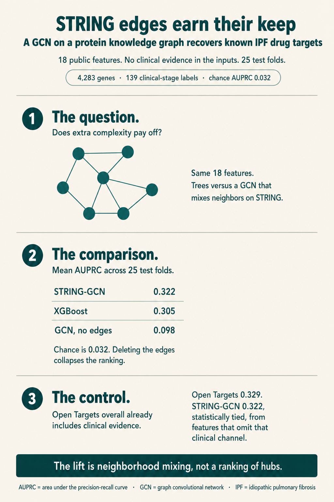
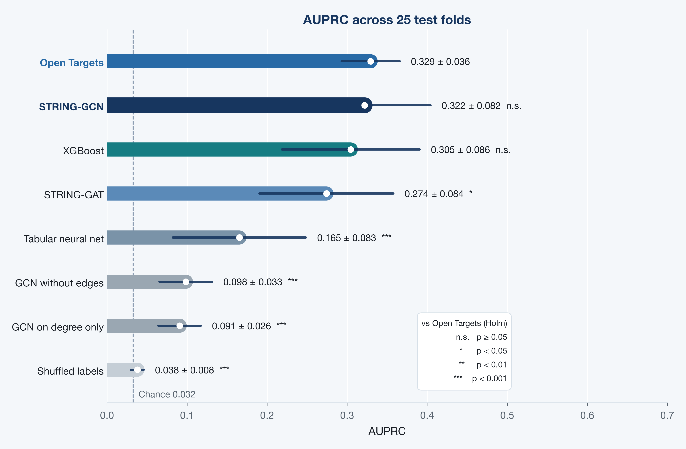
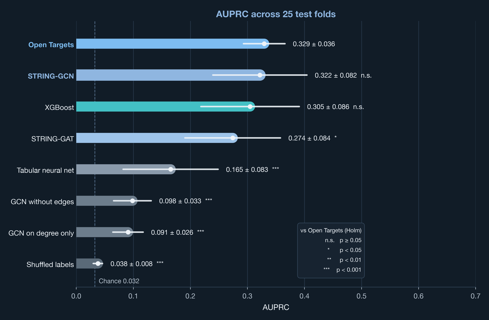
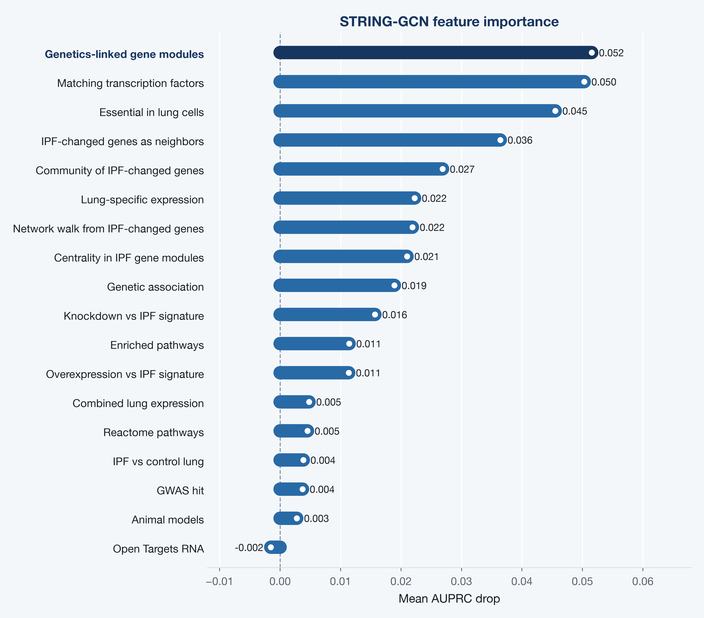
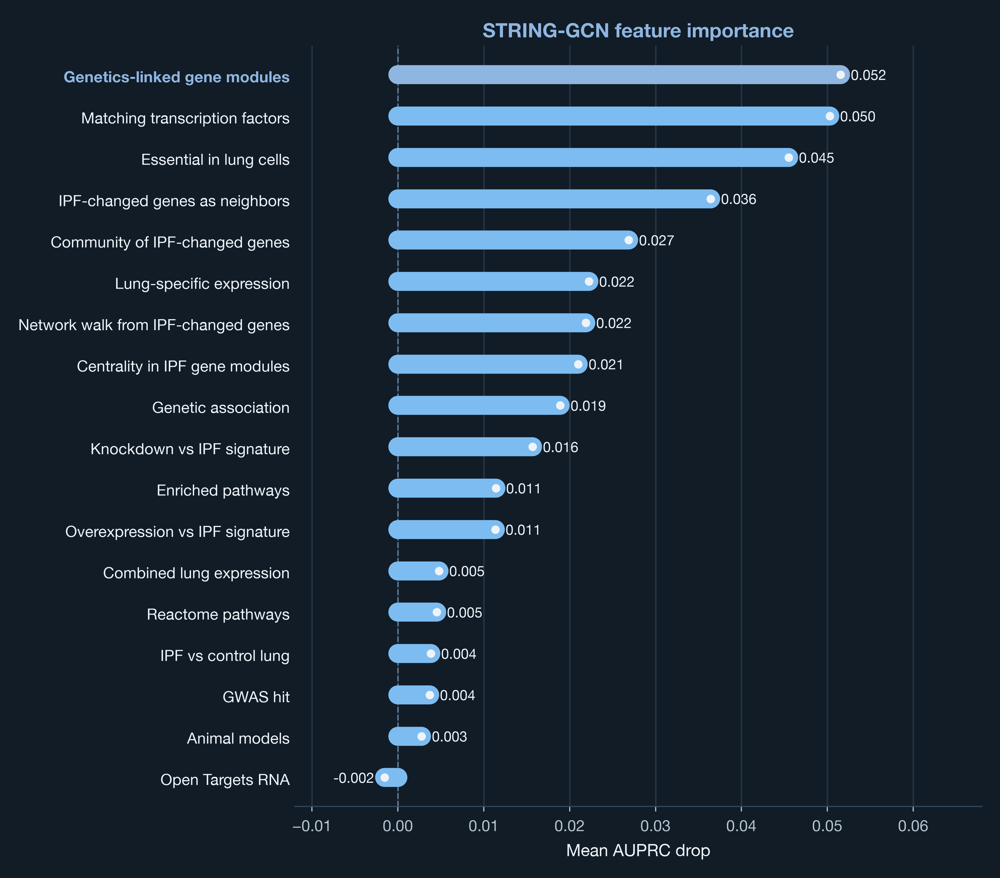

## Goals

Back at my data-scientist role at Idorsia, one of our main mandates was to identify new drug targets for focus diseases. We used a mix of methods: simple differential expression between disease and healthy samples, gradient boosting, and more advanced geometric models and autoencoders.

I wanted to take those learnings to idiopathic pulmonary fibrosis (IPF). It is relatively rare, yet a high-priority disease: progressive lung scarring [@raghu2011ipf], historically a median survival of about 3 to 5 years after diagnosis [@ley2011course], a severe quality-of-life burden, high cost per patient [@yang2026ipfcost], and only a handful of antifibrotics that slow decline [@king2014pirfenidone; @richeldi2014nintedanib]. Lung transplantation is the one potentially curative option. The medical need is obvious; the biology is hard (epithelial injury, fibroblasts, TGF-β, extracellular matrix) [@fernandez2012tgfb]. IPF was a natural disease in which to ask whether a protein knowledge graph, used as structure in a GCN [@kipf2017gcn], recovers more information than simpler models on the same public features. In other words: does the extra complexity pay off?

{fig-alt="Infographic summarizing the IPF ranker: STRING-GCN AUPRC 0.322, XGBoost 0.305, GCN without edges 0.098, Open Targets 0.329 as the positive control."}

## Data

| Piece | Freeze |
| --- | --- |
| Disease | IPF (`EFO_0000768`) |
| Universe | 4,283 Open Targets associated genes [@ochoa2023opentargets] |
| Labels | 139 genes with a clinical-stage mechanism of action (phase ≥ 1) |
| Chance AUPRC | 0.032 (prevalence) |
| Graph | STRING v12, combined score ≥ 700 [@szklarczyk2023string] |

I used 18 public features, one row per gene. Each feature is numeric and rank-scaled toward [0, 1]; 0 means no evidence in that feature.

**Genetics.** Open Targets genetic association for IPF [@ochoa2023opentargets], plus a sparse GWAS Catalog flag for IPF and interstitial-lung-disease genes [@sollis2023gwas].

**Expression and tissue.** A GEO meta-analysis of IPF versus control lung series [@barrett2013geo], the Open Targets RNA-expression association [@ochoa2023opentargets], lung specificity from GTEx [@gtex2020] and the Human Protein Atlas [@uhlen2015hpa], and a combined feature that takes the max of those lung-expression views.

**Pathways and regulation.** Membership in Reactome pathways enriched among differential-expression seeds [@gillespie2022reactome]; a transcription-factor feature whose targets match the GEO signature, from CollecTRI [@mullerdott2023collectri]; Open Targets animal-model evidence [@ochoa2023opentargets].

**STRING neighborhood.** Tabular geometry on the same protein network the GCN later uses [@szklarczyk2023string]: how many neighbors are IPF-changed genes, whether the gene sits in a community of those genes, a network walk from them, centrality in IPF gene modules, and the same module idea seeded by genetics. The GCN still mixes those features along edges.

**Perturbation.** LINCS L1000 knockdown and overexpression connectivity versus the IPF DE signature [@subramanian2017lincs], and DepMap CRISPR essentiality averaged over lung cancer lines [@tsherniak2017depmap]. That last feature is a lung prior, not an IPF prior.

The model input is those 18 features. The labels are a known-drug proxy: 139 genes with a clinical-stage mechanism of action (phase ≥ 1). Genes without that label stay unlabeled (positive-unlabeled ranking). I kept Open Targets clinical association out of the features; it defines the labels.

The implementation for this freeze is private.

## Methods

### Models

I trained every model on the same 18 features. Graph models also saw STRING edges. That isolates architecture from feature engineering.

| Model | What it is | Strength | Limit |
| --- | --- | --- | --- |
| **XGBoost** | Gradient-boosted trees on the 18 features. Inductive: a held-out gene is predicted from its row alone. | Strong default on mixed, sparse tabular features; early stopping is straightforward. | No message passing. STRING geometry only enters through neighborhood features I already computed. |
| **Tabular neural net** | Two-layer net (64 then 32), dropout 0.3. | Nonlinear tabular control without trees. | Few labeled genes; overfits more easily than trees on this matrix. |
| **STRING-GCN** | Two GCN layers, hidden 32, using STRING confidence as the edge weight. Each gene takes a degree-normalized average of its neighbors [@kipf2017gcn]. | Cheap mixer; matches homophilous PPI; uses the combined STRING score. | Neighbors are mixed uniformly (up to degree and edge weight). Training is transductive. |
| **STRING-GAT** | Two GAT layers, 16 hidden units × 4 heads [@velickovic2018gat]. | Can down-weight unhelpful neighbors. | More parameters; this freeze drops edge weights; ~111 labeled genes per train fold and ~82k edges. Attention is extra capacity that may not pay. |
| **GCN without edges** | Same GCN, empty edge set (self-loops only). | The control that shows whether edges add anything. | Not a production ranker. |
| **GCN on degree only** | STRING edges, features reduced to degree. | Hub check: tests whether ranking is high-degree proteins first. | Throws away the 18 features. |
| **Shuffled labels** | Same XGBoost, labels permuted. | Sanity check that AUPRC is not a metric bug. | Not a ranker. |
| **Open Targets** | Frozen Open Targets overall association. Not trained. The **positive control**. | Combines every Open Targets evidence type, including the clinical evidence that defines the labels [@ochoa2023opentargets]. That is the strongest public Open Targets ranking I can put on the same genes. | The clinical evidence that defines the labels sits inside this score. |

I compared STRING-GCN with GCN without edges and with XGBoost. GAT is the attention alternative on the same graph.

### Training, validation, and testing

The unit is a gene, not a sample. I split with **repeated stratified 5-fold CV** (`RepeatedStratifiedKFold`, 5 splits × 5 repeats, seed 42).

**Stratified.** There are only 139 labeled genes in 4,283 (about 3%). A random fold can easily get too few labeled genes for AUPRC to mean anything. Stratifying on the labels keeps that prevalence in every test fold (about 28 labeled genes among ~857 genes).

**5-fold.** In one pass, the universe is partitioned into five test sets. Each gene is held out as **test once**. The other four fifths are the outer pool for that fold, then split 80/20 into train and early-stopping validation, so a gene is not in the training loss on all four of those folds.

**Repeated.** AUPRC on ~28 labeled genes is noisy. I shuffled and repeated the 5-fold partition five times, still with seed 42. That gives **25 test folds**. The numbers I report are mean ± sd over those 25 evaluations, not a single lucky split. Across repeats a gene is held out more than once; the illustration ranking later averages those held-out predictions.

**Train / validation / test inside each fold.** The outer test genes (~857) are metrics only. The remaining genes split 80/20 into train (~2,740) and validation (~686). Validation is early stopping only: XGBoost watches AUPRC for 40 rounds; GCN and GAT watch full-graph validation AUPRC with patience 15; the tabular neural net uses patience 12. Test genes never enter the loss, the stopper, or the scaler fit. I froze hyperparameters before this confirmation run. The inner split is not a nested search.

XGBoost and the tabular neural net are inductive: a held-out gene is predicted from its features alone. The GNN is transductive: one forward pass on the full 4,283-gene graph each epoch, with binary cross-entropy only on train genes. I masked test labels. Test features still flow on STRING edges, so a test gene can be predicted from its neighbors. That is why I needed GCN without edges: it is the comparison that answers whether the graph helped.

Class imbalance is handled with a class weight from the training counts. Unlabeled genes stay unlabeled; I did not downsample them away.

### Benchmark metrics

I used **AUPRC** on held-out genes as the comparison, mean ± sd over the 25 test folds. That is the usual cross-validation summary: one AUPRC per held-out slice, then the mean. Chance AUPRC equals prevalence, about 0.032. With 3% labeled genes, AUROC can look fine while the top of the list is junk [@saito2015auprc]. Accuracy is worse: a model that ranks nobody still looks 97% correct.

The comparisons I care about are STRING-GCN versus GCN without edges (whether edges helped), versus XGBoost (whether geometry beat trees on the same features), versus shuffled labels (whether anything sat above chance), and versus Open Targets (the positive control).

Open Targets overall already mixes genetics, expression, animal models, text, and known-drug / clinical evidence into one association [@ochoa2023opentargets]. The clinical piece is the same evidence that defines the labels, which I kept out of the 18 features. That is why it is the positive control: the strongest public Open Targets ranking on these genes, clinical evidence included.

For each trained model I paired the 25 fold AUPRCs with the Open Targets AUPRC on the same test genes and ran a two-sided Wilcoxon signed-rank test on those differences [@wilcoxon1945]. Seven models, so I Holm-adjusted the p-values [@holm1979]. The AUPRC plot writes those tests after each mean ± sd: n.s. if p ≥ 0.05, one star if p < 0.05, two stars if p < 0.01, three stars if p < 0.001.

### Feature importance

I ranked the 18 features by how much the trained STRING-GCN depends on each one. On the same 25 test folds as the confirmation run, I trained STRING-GCN, recorded held-out AUPRC, then shuffled one feature on every gene and recorded held-out AUPRC again. The drop is baseline minus shuffled. I average those drops over the 25 folds. The trained weights stay fixed; only that feature is shuffled. Because training is transductive, the shuffle hits every gene, so neighbors lose that feature too.

## Results

### Model performance

Each of the 25 test folds has its own AUPRC on the held-out genes. The comparison is the mean ± sd of those 25 numbers. Stars after each number are Holm-adjusted Wilcoxon tests against Open Targets.

::: {.light-content}
{fig-alt="Horizontal pill bars of mean AUPRC across 25 test folds. A white marker sits at the mean; a rounded whisker is plus or minus one standard deviation. Holm stars sit after each mean plus or minus sd: STRING-GCN and XGBoost are n.s., STRING-GAT is one star, the remaining four are three stars. A dashed line marks chance at 0.032. A legend defines n.s., one star, two stars, and three stars."}
:::

::: {.dark-content}
{fig-alt="Horizontal pill bars of mean AUPRC across 25 test folds. A light marker sits at the mean; a rounded whisker is plus or minus one standard deviation. Holm stars sit after each mean plus or minus sd: STRING-GCN and XGBoost are n.s., STRING-GAT is one star, the remaining four are three stars. A dashed line marks chance at 0.032. A legend defines n.s., one star, two stars, and three stars."}
:::

STRING-GCN was the trained winner. It beat GCN without edges in **25/25** folds (mean AUPRC lift about 0.22). The protein knowledge graph added information: the same architecture, without STRING edges, fell near 0.10. GCN on degree only stayed near 0.09, so the lift is neighborhood mixing of the features, not a ranking of hubs.

It tied XGBoost (GCN ahead on 16/25 folds, overlapping SDs). Trees already see precomputed STRING neighborhood features; the GCN still gained by mixing those features along the actual edges. The tabular neural net lagged both (0.165): a small net overfits this 3% labeled matrix more than depth-4 trees.

GAT lost to GCN on 21/25 folds. The remaining information is homophilous STRING mixing: a gene looks like its neighbors. A degree-normalized average matches that bias. With ~111 labeled genes per train fold and 82k edges, GCN was the mixer that fit. GAT still beat GCN without edges, so attention was running; it was the worse inductive bias here.

STRING-GCN matched the positive control on AUPRC (n.s., Δ -0.008). XGBoost did too (n.s., Δ -0.025). STRING-GAT sat below Open Targets (0.274, Holm p < 0.05). The remaining controls sat well below (Holm p < 0.001).

Shuffled labels is the sanity check: same XGBoost, labels permuted. AUPRC fell to 0.038, which is chance (0.032). The metric is not inventing a ranking from the 3% prevalence.

What STRING-GCN recovered at 0.322 is therefore a real ranking of known clinical-stage mechanisms, from the 18 features that omit the clinical evidence. Open Targets overall is close (0.329) because that public score includes that evidence.

### Feature importance

I ranked the 18 features by mean AUPRC drop in the winning STRING-GCN: how much held-out AUPRC falls after shuffling that feature on every gene (neighbors lose it too).

::: {.light-content}
{fig-alt="Horizontal pill bars of mean AUPRC drop after shuffling each of the 18 features in the trained STRING-GCN. Genetics-linked gene modules lead at 0.052, then matching transcription factors at 0.050 and lung-cell essentiality at 0.045."}
:::

::: {.dark-content}
{fig-alt="Horizontal pill bars of mean AUPRC drop after shuffling each of the 18 features in the trained STRING-GCN. Genetics-linked gene modules lead at 0.052, then matching transcription factors at 0.050 and lung-cell essentiality at 0.045."}
:::

Genetics-linked gene modules, matching transcription factors, and lung-cell essentiality are the three features the trained GCN leans on (drops 0.052, 0.050, 0.045). STRING neighborhood features come next: IPF-changed genes as neighbors, community, the network walk, and module centrality. GEO lung expression, GWAS flags, animal models, and Open Targets RNA sit at the bottom (drops near 0).

### Target ranking

I looked at out-of-fold STRING-GCN predictions for illustration (each gene's prediction is the mean of the folds that held it out). **Known** means the gene is one of the 139 clinical-stage mechanisms I used as labels (phase ≥ 1). **Novel** means it is not: a hypothesis on this freeze, not a recovered training example.

| Gene | Known or novel | STRING-GCN | Note |
| --- | --- | ---: | --- |
| TGFB1 | Known | 0.61 | Canonical fibrosis biology [@fernandez2012tgfb] |
| TNF | Known | 0.71 | Neighborhood lifts a known mechanism |
| PDGFRB | Known | 0.58 | Nintedanib-family target [@richeldi2014nintedanib] |
| MUC5B | Novel | 0.33 | Famous IPF risk gene; stays mid-rank [@seibold2011muc5b] |
| COX7B | Novel | 0.77 | Top novel hit: respiratory-chain hub |

The model recovered known clinical mechanisms in the TGF-β, TNF, and PDGFR families without putting clinical association into the features. TNF was the clearest neighborhood lift: XGBoost predicted 0.47; the GCN predicted 0.71.

MUC5B is the genetic signature of IPF risk and is Novel in this table: it is not a clinical-stage mechanism under the definition of the labels. Mid-rank is the honest outcome: a risk gene is not the same decision as a drug mechanism.

Those high novel ranks (COX7B, other respiratory-chain subunits, HRAS, MAPK1) are the genes I would prioritize for a chemist or a biologist. They are shaped by the same STRING geometry that recovered the known targets.

## Conclusions

I started this freeze with a question from target identification: on public IPF data, does a protein knowledge graph earn its keep, or do trees on the same 18 features already do the job? On the confirmation metric, mean AUPRC across 25 test folds, the graph earned it. STRING-GCN recovered known clinical-stage mechanisms at **0.322**. XGBoost on the same features reached **0.305**. The same GCN with the STRING edges deleted fell to **0.098**, in every fold. The lift is neighborhood mixing of the features, not a more fashionable architecture and not a ranking of hubs.

That trained ranking sat next to Open Targets overall at 0.329. Open Targets is the positive control: it already combines every evidence type in that database, including the clinical evidence that defines the labels, which I kept out of the 18 features. I am not offering a better Open Targets. I am offering a GCN that, from genetics, tissue, pathways, perturbation, and STRING, recovers a neighborhood-shaped trace of the same mechanisms, close enough that a Wilcoxon test cannot tell the two lists apart.

What the GCN used matches that picture. It leans on genetics-linked modules, transcription factors whose targets match the IPF signature, and lung-cell essentiality, then on STRING neighborhood. It does not lean on a GEO volcano plot. Known mechanisms in the TGF-β, TNF, and PDGFR families come back without a known-drug column. High novel ranks such as COX7B are the next conversation with a chemist: hypotheses shaped by the same geometry, not recovered labels. MUC5B staying mid-rank is the other honest outcome. A famous risk gene is not a drug mechanism.

This freeze is still a laptop experiment: public features, one disease, a known-drug proxy as the labels, a transductive GNN. DepMap is essentiality in lung cancer lines, not IPF tissue. If I ran the same question inside a company I would train on older evidence and test on clinical-stage genes that only appeared later, use an indication-specific graph, and add chemist labels.

## References

::: {#refs}
:::
