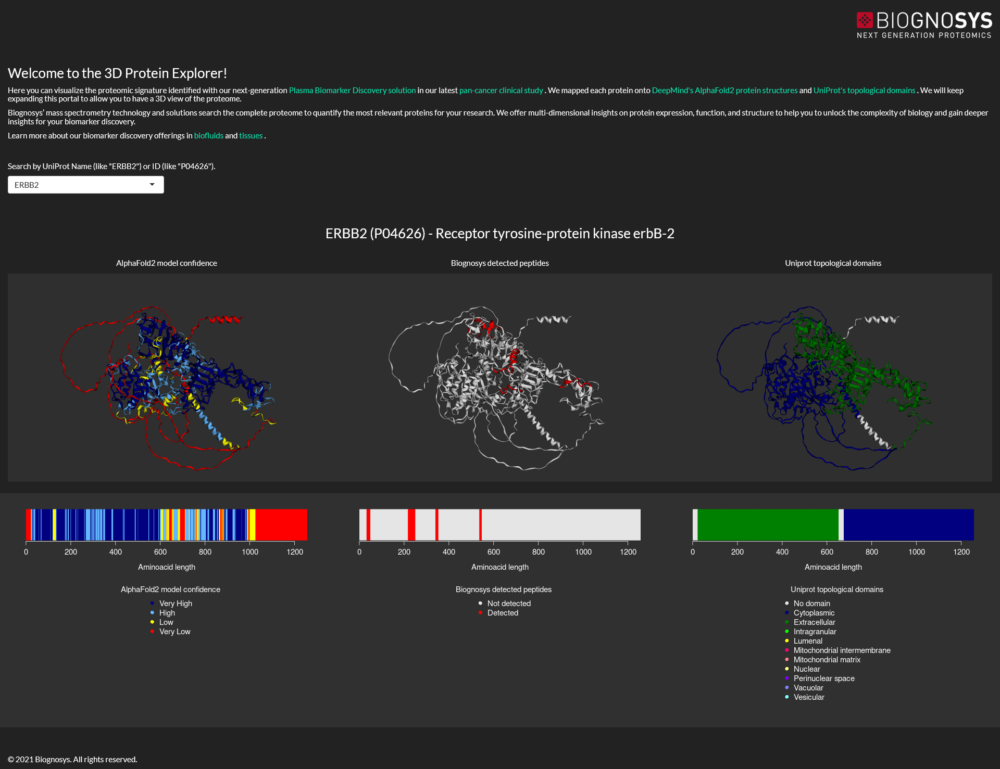
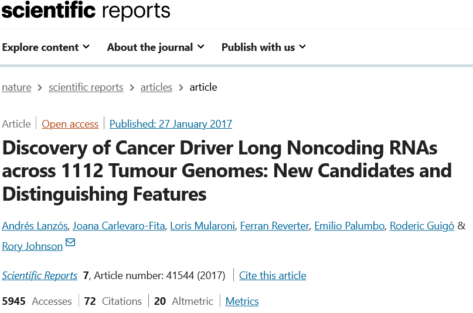
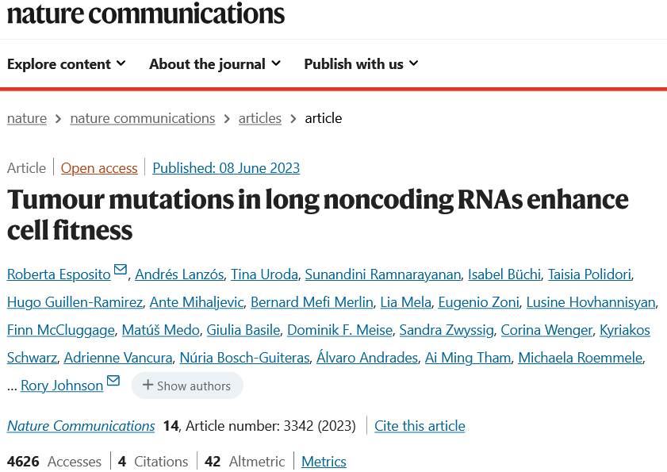
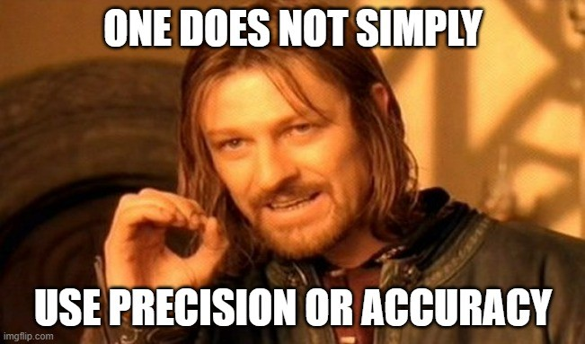
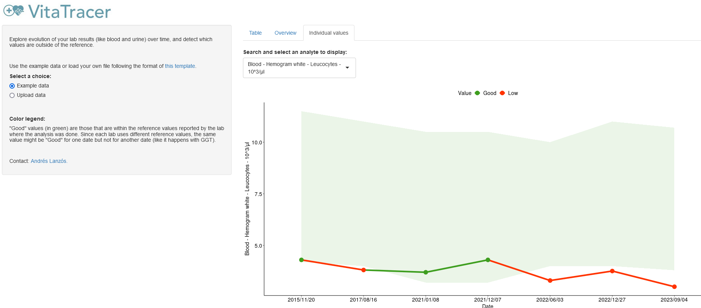
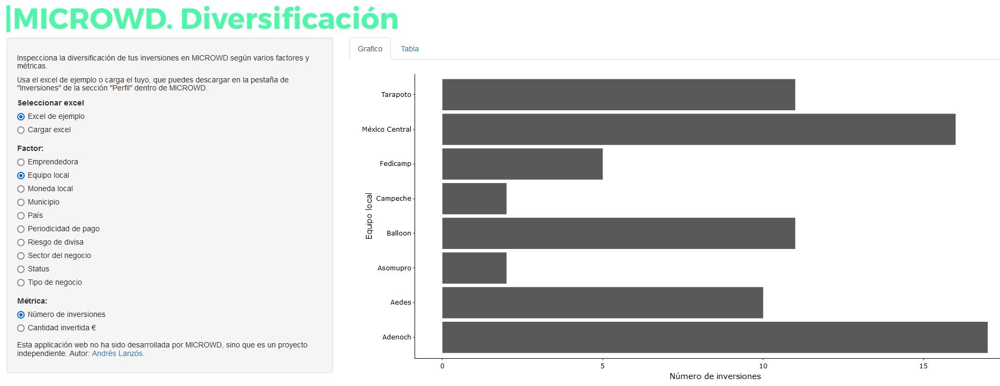

The projects below show how I approach scientific questions as products: define the decision, build a reproducible analytical core, make the result understandable, and create something that people can use.

## 3D Protein Explorer

::: {.project-date}
June 2022
:::

::: {.project-feature}
::: {.columns}
::: {.column width="58%"}
### Connecting mass spectrometry with protein structure

While working in R&D at [Biognosys](https://biognosysgroup.com/), I identified an opportunity to connect newly released AlphaFold structures with the company’s proteomics coverage. The resulting [3D Protein Explorer](https://biognosys.shinyapps.io/3D_protein_explorer/) lets users select a protein and see which regions are observed by mass spectrometry.

I built the public Shiny application and designed a responsive data-loading approach that could search thousands of proteins without freezing the interface. The project was developed alongside my main work and involved collaboration with business and marketing teams to turn a technical capability into a customer-facing demonstration.

**Focus:** R · Shiny · proteomics · AlphaFold · scientific visualization · product collaboration
:::

::: {.column width="42%"}
{.project-image}
:::
:::
:::

## ExInAtor and ExInAtor2

::: {.project-date}
2017–2023
:::

::: {.project-feature}
::: {.columns}
::: {.column width="58%"}
### Finding cancer-driver long non-coding RNAs

During my PhD, I developed [ExInAtor](https://github.com/alanzos/ExInAtor), the first method designed specifically to identify long non-coding RNAs recurrently mutated in cancer. The work was published in [Scientific Reports](https://www.nature.com/articles/srep41544), where I was first author.

I later developed [ExInAtor2](https://github.com/gold-lab/ExInAtor2), adding functional-impact evidence to mutation frequency and optimizing Python and R workflows to run millions of simulations efficiently. Experimental validation led by Roberta Esposito supported the predictions; the work was published in [Nature Communications](https://www.nature.com/articles/s41467-023-39160-7), where I was co-first author.

**Focus:** Python · R · cancer genomics · statistical simulation · high-performance computing · reproducible research
:::

::: {.column width="42%"}
{.project-image}

{.project-image}
:::
:::
:::

## Evaluating binary classifiers beyond accuracy

::: {.project-date}
January 2023
:::

::: {.project-feature}
::: {.columns}
::: {.column width="58%"}
### Choosing metrics that match biomedical decisions

Accuracy and precision can be misleading when classes are imbalanced or when the costs of false positives and false negatives differ. I explored these failure modes and compared alternative evaluation approaches for biomedical classification.

[Read the article](articles/2023-01-19-mcc-phi-coefficient/) or inspect the [reproducible code and examples on GitHub](https://github.com/alanzos/performance_metrics_for_binary_classification).

**Focus:** model evaluation · imbalanced classification · statistical reasoning · technical communication
:::

::: {.column width="42%"}
{.project-image}
:::
:::
:::

## VitaTracer

::: {.project-date}
May 2023
:::

::: {.project-feature}
::: {.columns}
::: {.column width="58%"}
### Making longitudinal laboratory results easier to understand

I created [VitaTracer](https://andreslanzos.shinyapps.io/VitaTracer) after finding it difficult to compare blood and urine test results across time. The Shiny application summarizes laboratory measurements and makes longitudinal changes easier to inspect.

The [source code is available on GitHub](https://github.com/alanzos/VitaTracer).

**Focus:** R · Shiny · longitudinal data · health-data visualization
:::

::: {.column width="42%"}
{.project-image}
:::
:::
:::

## Investment-diversification explorer

::: {.project-date}
February 2023
:::

::: {.project-feature}
::: {.columns}
::: {.column width="58%"}
### Exploring concentration and diversification interactively

This [Shiny application](https://andreslanzos.shinyapps.io/microwd_diversification/) explores diversification across my investments in Microwd. It translates portfolio composition into an interactive view designed to support clearer reasoning about concentration.

The [source code is available on GitHub](https://github.com/alanzos/microwd_diversification).

**Focus:** R · Shiny · interactive analytics · financial data visualization
:::

::: {.column width="42%"}
{.project-image}
:::
:::
:::
